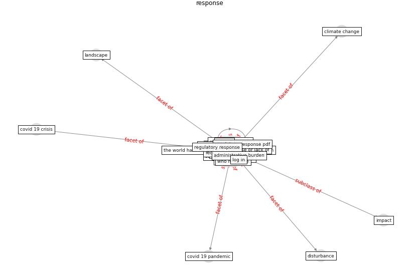

# Keyword: __response__
## Clusters

* Cluster 10: [city-smart](cluster_10)
* Cluster 12: [climate-change](cluster_12)

## Concepts

 

## Top 10 articles for __response__
* The COVID-19 pandemic: Impacts on cities and major
lessons for urban planning, design, and management ([sharifi_covid-19_2020](article_sharifi_covid-19_2020))
* world_bank_world_2022 ([world_bank_world_2022](article_world_bank_world_2022))
* Respiratory pandemics, urban planning and design: A
multidisciplinary rapid review of the literature ([harris_respiratory_2022](article_harris_respiratory_2022))
* How COVID-19 Could Accelerate the Adoption of
New Retail Technologies and Enhance the
(E-)Servicescape ([willems_how_2021](article_willems_how_2021))
* Response to COVID-19 in Taiwan: Big Data
Analytics, New Technology, and Proactive
Testing ([wang_response_2020](article_wang_response_2020))
* rtpi_urban_2021 ([rtpi_urban_2021](article_rtpi_urban_2021))
* Readiness Assessment of Green Building
Certification Systems for Residential Buildings
during Pandemics ([tleuken_readiness_2021](article_tleuken_readiness_2021))
* afrin_covid-19_2021 ([afrin_covid-19_2021](article_afrin_covid-19_2021))
* Amplifying the role of knowledge translation platforms in
the COVID-19 pandemic response ([el-jardali_amplifying_2020](article_el-jardali_amplifying_2020))
* Smart cities and the pandemic: digital technologies on the
urban management of Brazilian cities ([fariniuk_smart_2020](article_fariniuk_smart_2020))
