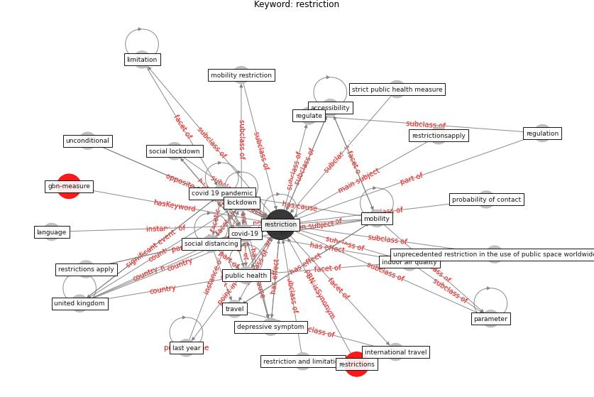

# Keyword: restriction

* [gbn-measure](cluster_Cluster_10)

## Keywords

 * Cluster_10, accessibility, authorship contribution statement, contact, [control](keyword_control), [covid 19 pandemic](keyword_covid_19_pandemic), [covid-19](keyword_covid-19), [depressive symptom](keyword_depressive_symptom), government decision, [indoor air quality](keyword_indoor_air_quality), inhibitions, language, language restriction, last year, [limitation](keyword_limitation), [lockdown](keyword_lockdown), [mobility](keyword_mobility), mobility restriction, parameter, probability of contact, [public health](keyword_public_health), regulate, regulation, [restriction](keyword_restriction), restriction and limitation, restrictions, restrictions apply, restrictionsapply, strict public health measure, [travel](keyword_travel), unconditional, [united kingdom](keyword_united_kingdom), unprecedented restriction in the use of public space worldwide, waste management

## Concepts

 

## Neighbours

### Closest articles

* An Automated System to Limit COVID-19 Using Facial Mask Detection in Smart City Network - [LINK](article_rahman_automated_2020)
* The impact of the COVID-19 pandemic on the importance of urban green spaces to the public - [LINK](article_noszczyk_impact_2022)
* COVID-ABS: An agent-based model of COVID-19 epidemic to simulate health and economic effects of social distancing interventions - [LINK](article_silva_covid-abs_2020)
* How the 5G Enabled the COVID-19 Pandemic Prevention and Control: Materiality, Affordance, and (De-)Spatialization - [LINK](article_li_how_2022)
* COVID-19 Pandemic: Rethinking Strategies for Resilient Urban Design, Perceptions, and Planning - [LINK](article_afrin_covid-19_2021)
* Digital Twin of COVID-19 Mass Vaccination Centers - [LINK](article_pilati_digital_2021)
* The Impact of COVID-19 on Public Space: A Review of the Emerging Questions - [LINK](article_honey-roses_impact_2020)
* Design COVID-19 Ontology: A Healthcare and Safety Perspective - [LINK](article_aloulou_design_2022)
* The psychological impact of COVID-19 on the mental health in the general population - [LINK](article_serafini_psychological_2020)
* Effects of temperature and humidity on the spread of COVID-19: A systematic review - [LINK](article_mecenas_effects_2020)

### Closest BPs

