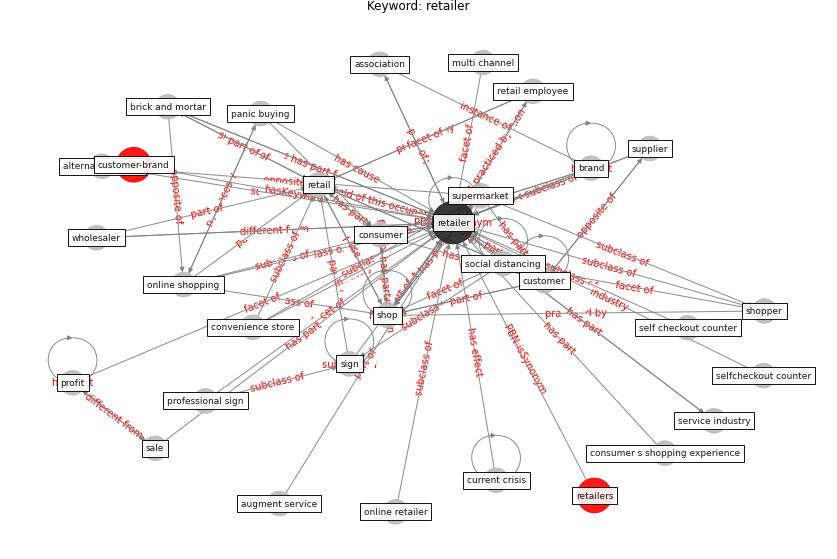

# Keyword: retailer

* [customer-brand](cluster_Cluster_8)

## Keywords

 * Cluster_8, alternative outlet, association, assortment, augment service, [brand](keyword_brand), brand image, brick and mortar, brick and mortar retailing, [business](keyword_business), changi recommend, coffee shop, competition, [consumer](keyword_consumer), consumer s shopping experience, convenience store, corporate social responsibility, current crisis, [customer](keyword_customer), customer experience, digital footprint, digital sign, digital solution, distribution chain, distribution channel, distribution network, e commerce, [employee](keyword_employee), experience, go online, [government](keyword_government), government regulation, grocery, in store, independent retailer, inventory tracking, just in time inventory management, manage in store crowd, merchandise, multi channel, new technology, online grocer, online retail, online retailer, online retailing, [online shopping](keyword_online_shopping), panic buying, panic buying period, privacy sensitive technology, professional sign, profit, promotion, [retail](keyword_retail), retail employee, retail management, [retailer](keyword_retailer), retailers, [sale](keyword_sale), sale of item, self checkout counter, selfcheckout, selfcheckout counter, service industry, service sector, shop, shop online, shopper, [sign](keyword_sign), single location retailer, [social distancing](keyword_social_distancing), store network, supermarket, supplier, [supply chain](keyword_supply_chain), target, [technology](keyword_technology), wholesaler

## Concepts

 

## Neighbours

### Closest articles

* How COVID-19 Could Accelerate the Adoption of New Retail Technologies and Enhance the (E-)Servicescape - [LINK](article_willems_how_2021)
* Retail Signage During the COVID-19 Pandemic - [LINK](article_mcneish_retail_2020)
* Touchless Retail: What the Rest of the World could learn from China’s new ways to shop - [LINK](article_capgemini_touchless_2020)
* Mapping research in logistics and supply chain management during COVID-19 pandemic - [LINK](article_montoya-torres_mapping_2021)
* The Impact of COVID-19 on Public Space: A Review of the Emerging Questions - [LINK](article_honey-roses_impact_2020)
* Effects to Construction Project Management Impacted Circular Economic of Covid-19 Pandemic - [LINK](article_paikan_effects_2021)

### Closest BPs

