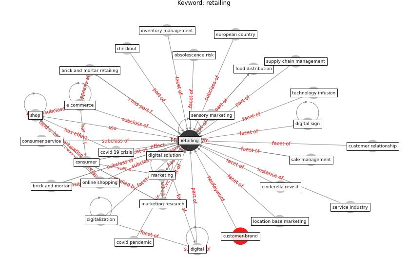

# Keyword: retailing

* [customer-brand](cluster_Cluster_8)

## Keywords

 * Cluster_8, brick and mortar, brick and mortar retailing, checkout, cinderella revisit, [consumer](keyword_consumer), consumer service, [covid 19 crisis](keyword_covid_19_crisis), covid pandemic, customer relationship, [digital](keyword_digital), digital sign, digital solution, digitalization, e commerce, european country, food distribution, inventory management, location base marketing, [marketing](keyword_marketing), marketing research, obsolescence risk, [online shopping](keyword_online_shopping), [retailing](keyword_retailing), sale management, sensory marketing, service industry, shop, [supply chain management](keyword_supply_chain_management), technology infusion, touch enable technology

## Concepts

 

## Neighbours

### Closest articles

* How COVID-19 Could Accelerate the Adoption of New Retail Technologies and Enhance the (E-)Servicescape - [LINK](article_willems_how_2021)
* What drives unverified information sharing and cyberchondria during the COVID-19 pandemic? - [LINK](article_laato_what_2020)
* The socio-economic implications of the coronavirus pandemic (COVID-19): A review - [LINK](article_nicola_socio-economic_2020)

### Closest BPs

