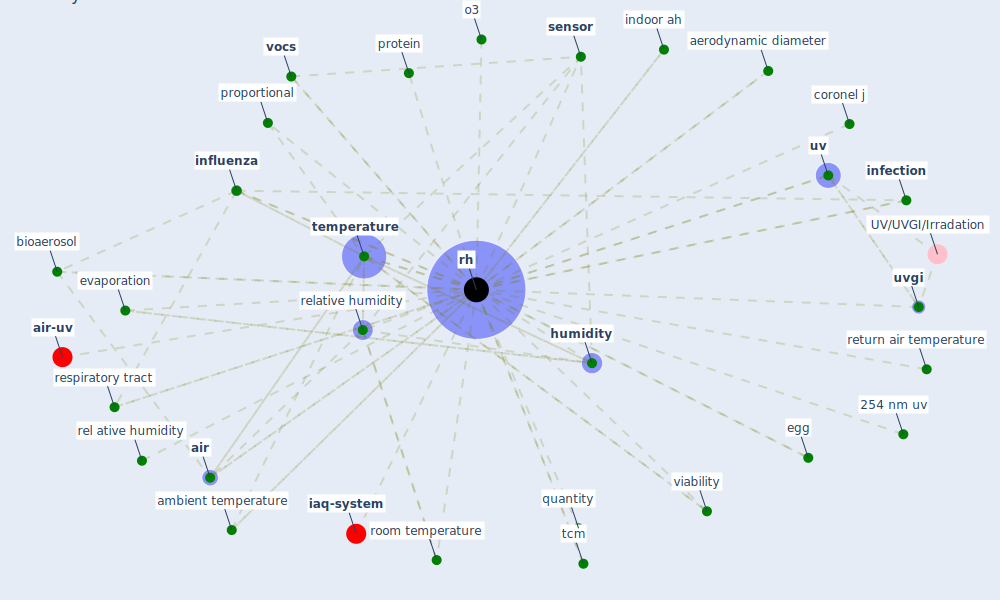

# Keyword: rh

* [air-uv](cluster_3)

* [iaq-system](cluster_10)

## Keywords

 * 254 nm uv, 90 rh, Cluster_10, Cluster_3, aerodynamic diameter, [air](keyword_air), ambient temperature, [bioaerosol](keyword_bioaerosol), coronel j, efficient, egg, evaporation, [hong kong](keyword_hong_kong), humidifier, [humidity](keyword_humidity), indoor ah, [infection](keyword_infection), [influenza](keyword_influenza), [influenza virus](keyword_influenza_virus), interaction term, low respiratory tract, maintain between 40 and 60 within the build environment, o3, proportional, protein, quantity, rel ative humidity, relative humidity, respiratory tract, return air temperature, [rh](keyword_rh), rhs, room temperature, [sensor](keyword_sensor), tcm, [temperature](keyword_temperature), [uv](keyword_uv), [uvgi](keyword_uvgi), viability, [vocs](keyword_vocs)

## Mapping

## Neighbours

### Closest articles

* Mechanistic insights into the effect of humidity on airborne influenza virus survival, transmission and incidence - [LINK](article_marr_mechanistic_2019)
* Effect of Ultraviolet Germicidal Irradiation on Viral Aerosols - [LINK](article_walker_effect_2007)
* A comprehensive review on indoor air quality monitoring systems for enhanced public health - [LINK](article_saini_comprehensive_2020)
* Characterization and performance evaluation of a full-scale activated carbon-based dynamic botanical air filtration system for improving indoor air quality - [LINK](article_wang_characterization_2011)
* Applications of ultraviolet germicidal irradiation disinfection in health care facilities: Effective adjunct, but not stand-alone technology - [LINK](article_memarzadeh_applications_2010)
* Environmental factors involved in SARS-CoV-2 transmission: effect and role of indoor environmental quality in the strategy for COVID-19 infection control - [LINK](article_azuma_environmental_2020)
* Methods for air cleaning and protection of building occupants from airborne pathogens - [LINK](article_bolashikov_methods_2009)
* ASHRAE Position Document on Infectious Aerosols - [LINK](article_ashrae_ashrae_2022)
* Upper-Room Ultraviolet Light and Negative Air Ionization to Prevent Tuberculosis Transmission - [LINK](article_escombe_upper-room_2009)

### Closest BPs

