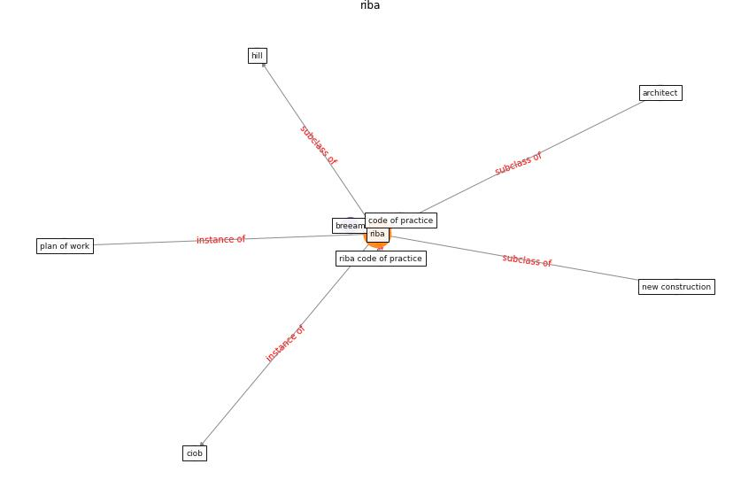

# Keyword: __riba__
## Clusters

* Cluster 2: [construction-resilience](cluster_2)

## Concepts

 

## Articles
* nassereddine_propositions_2021-150 ([nassereddine_propositions_2021-150](article_nassereddine_propositions_2021-150))
* breeam_covid-19_2020-0 ([breeam_covid-19_2020-0](article_breeam_covid-19_2020-0))
* Navigating Climate Change: Rethinking the Role of
Buildings ([cole_navigating_2020](article_cole_navigating_2020))
* Covid-19 Associated Risks and Mitigation
Strategies relevant for the UK Construction
Industry ([dan-jumbo_covid-19_2021](article_dan-jumbo_covid-19_2021))
* Overcoming the Impact of COVID-19 Using Integrated
Project Delivery Model ([g_overcoming_2020](article_g_overcoming_2020))
* realdania_refleksioner_2022_EN-1200 ([realdania_refleksioner_2022_EN-1200](article_realdania_refleksioner_2022_EN-1200))
* realdania_refleksioner_2022_EN-150 ([realdania_refleksioner_2022_EN-150](article_realdania_refleksioner_2022_EN-150))
* realdania_refleksioner_2022_EN-1450 ([realdania_refleksioner_2022_EN-1450](article_realdania_refleksioner_2022_EN-1450))
* realdania_refleksioner_2022_EN-1400 ([realdania_refleksioner_2022_EN-1400](article_realdania_refleksioner_2022_EN-1400))
* realdania_refleksioner_2022_EN-1350 ([realdania_refleksioner_2022_EN-1350](article_realdania_refleksioner_2022_EN-1350))
