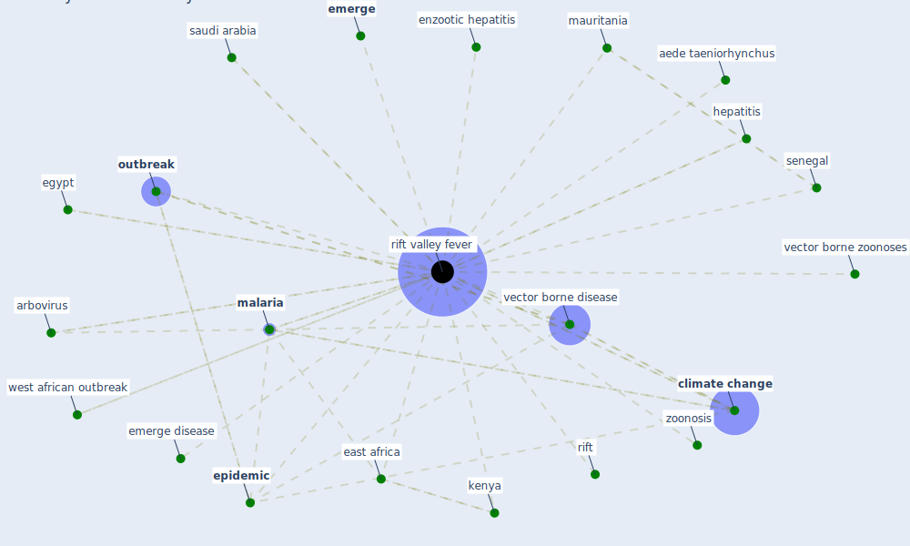

# Keyword: rift valley fever

## Keywords

 * aede taeniorhynchus, arbovirus, [climate change](keyword_climate_change), east africa, egypt, [emerge](keyword_emerge), emerge disease, enzootic hepatitis, [epidemic](keyword_epidemic), hepatitis, [kenya](keyword_kenya), [malaria](keyword_malaria), mauritania, [outbreak](keyword_outbreak), rift, [rift valley fever](keyword_rift_valley_fever), [saudi arabia](keyword_saudi_arabia), senegal, [vector borne disease](keyword_vector_borne_disease), vector borne zoonoses, west african outbreak, zoonosis

## Mapping

## Neighbours

### Closest articles

* The impact of climate change on the epidemiology and control of Rift Valley fever - PubMed - [LINK](article_martin_impact_2008)
* Addressing vulnerability, building resilience: community-based adaptation to vector-borne diseases in the context of global change - [LINK](article_bardosh_addressing_2017)

### Closest BPs

