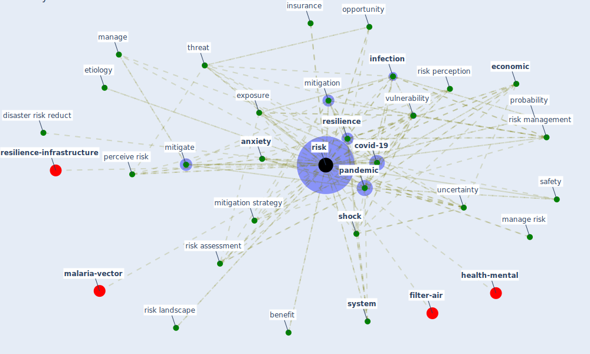

# Keyword: risk

* [health-city](cluster_1)

* [building-design](cluster_2)

* [construction-project](cluster_5)

* [air-uv](cluster_8)

* [space-cid](cluster_10)

## Keywords

 * adventure, [analysis](keyword_analysis), [anxiety](keyword_anxiety), asymmetric information, avoid they, benefit, bias, consequence, [construction](keyword_construction), [construction industry](keyword_construction_industry), contingent liability, [control](keyword_control), controllable, [covid-19](keyword_covid-19), credit, credit risk, credit underwriting, cross infection, debt, decision make, develop country, disaster risk reduct, [economic](keyword_economic), [economic crisis](keyword_economic_crisis), economic risk, [economy](keyword_economy), estimate, ethic, etiology, exinfection, [exposure](keyword_exposure), exposure risk, [factor](keyword_factor), [health](keyword_health), [health and safety](keyword_health_and_safety), [high](keyword_high), idiosyncratic risk, [infect](keyword_infect), [infection](keyword_infection), [infectious disease](keyword_infectious_disease), insolvency, insurance, interconnect, know they avoid they, [knowledge](keyword_knowledge), layer of risk, loan default, low risk, manage, manage risk, manage these risk, [management](keyword_management), mitigate, [mitigation](keyword_mitigation), mitigation strategy, opportunity, [pandemic](keyword_pandemic), [perceive risk](keyword_perceive_risk), perception, probability, probability of occurrence, protective factor, prudent, [resilience](keyword_resilience), respiratory disease, [response](keyword_response), reward, [risk](keyword_risk), risk assess, risk assessment, risk base, risk description, risk evaluation, risk event, risk identification, risk landscape, risk management, risk of infection, [risk perception](keyword_risk_perception), risk prediction, risk profile, risk society theory, [safety](keyword_safety), secondary source, [shock](keyword_shock), sovereign debt, [stakeholder](keyword_stakeholder), [stress](keyword_stress), [supply chain management](keyword_supply_chain_management), [system](keyword_system), systemic gap, terrorism, threat, trade off, uncertainty, uninformed, uninformed practice, [urban governance](keyword_urban_governance), [vulnerability](keyword_vulnerability), weakness

## Mapping

## Neighbours

### Closest articles

* Guidelines for resilience systems analysis - [LINK](article_oecd_guidelines_2014)
* World Bank Development Report - [LINK](article_world_bank_world_2022)
* Seeing the invisible hand: Underlying effects of COVID-19 on tourists’ behavioral patterns - [LINK](article_li_seeing_2020)
* Assessment of COVID-19 precautionary measures in sports facilities: A case study on a health club in Saudi Arabia - [LINK](article_ibrahim_assessment_2022)
* COVID-19 and a new resilient infrastructure landscape - [LINK](article_oecd_covid-19_2021)
* COVID-19 Could Leverage a Sustainable Built Environment - [LINK](article_pinheiro_covid-19_2020)
* The impacts of knowledge, risk perception, emotion and information on citizens’ protective behaviors during the outbreak of COVID-19: a cross-sectional study in China - [LINK](article_ning_impacts_2020)
* Should I Stay or Should I Go? Tourists’ COVID-19 Risk Perception and Vacation Behavior Shift - [LINK](article_bratic_should_2021)
* Strengthening resilience: a priority shared by Health 2020 and - [LINK](article_who_strengthening_2017)
* COVID-19 pandemic: the effects and prospects in the construction industry. - [LINK](article_ogunnusi_covid-19_2020)

### Closest BPs

