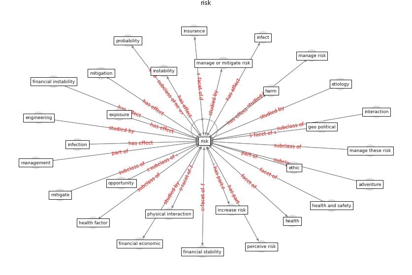

# Keyword: __risk__
## Clusters

* Cluster 0: [health-city](cluster_0.md)
* Cluster 2: [construction-resilience](cluster_2.md)
* Cluster 9: [resilience-infrastructure](cluster_9.md)

## Concepts

 

## Articles
* oecd_guidelines_2014 ([oecd_guidelines_2014](article_oecd_guidelines_2014.md))
* Seeing the invisible hand: Underlying effects of
COVID-19 on tourists’ behavioral patterns ([li_seeing_2020](article_li_seeing_2020.md))
* The impacts of knowledge, risk perception, emotion and
information on citizens’ protective behaviors during the
outbreak of COVID-19: a cross-sectional study in
China ([ning_impacts_2020](article_ning_impacts_2020.md))
* Assessment of COVID-19 precautionary measures in sports
facilities: A case study on a health club in Saudi
Arabia ([ibrahim_assessment_2022](article_ibrahim_assessment_2022.md))
* oecd_covid-19_2021 ([oecd_covid-19_2021](article_oecd_covid-19_2021.md))
* who_strengthening_2017 ([who_strengthening_2017](article_who_strengthening_2017.md))
* ogunnusi_covid-19_2020 ([ogunnusi_covid-19_2020](article_ogunnusi_covid-19_2020.md))
* The effect of occupant distribution on energy consumption
and COVID-19 infection in buildings: A case study of
university building ([mokhtari_effect_2021](article_mokhtari_effect_2021.md))
* Covid-19 Associated Risks and Mitigation
Strategies relevant for the UK Construction
Industry ([dan-jumbo_covid-19_2021](article_dan-jumbo_covid-19_2021.md))
* COVID19-Routes: A Safe Pedestrian Navigation
Service ([cantarero_covid19-routes_2021](article_cantarero_covid19-routes_2021.md))
