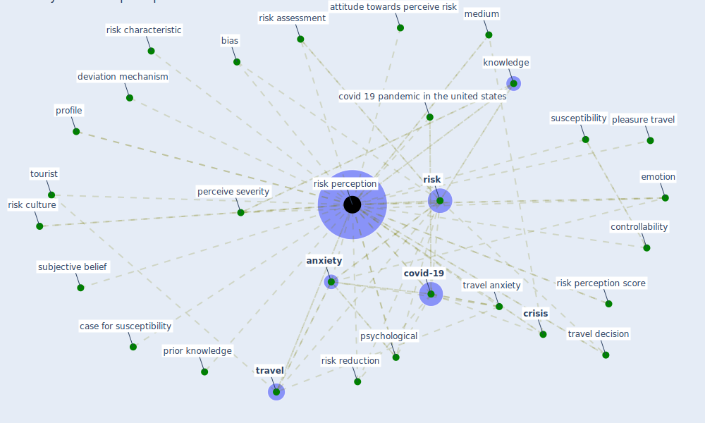

# Keyword: risk perception

## Keywords

 * [anxiety](keyword_anxiety), anxiety factor 2, attitude towards perceive risk, behavior shift, bias, case for susceptibility, controllability, covid 19 pandemic in the united states, [covid-19](keyword_covid-19), [crisis](keyword_crisis), deviation mechanism, discrete emotion, emotion, experi ence, experi enced tourist, information exposure, [knowledge](keyword_knowledge), [management](keyword_management), medium, nuclear energy, [perceive risk](keyword_perceive_risk), perceive severity, perception, pleasure travel, prior knowledge, profile, [psychological](keyword_psychological), [risk](keyword_risk), risk assessment, risk characteristic, risk communication, risk culture, [risk perception](keyword_risk_perception), risk perception score, risk perceptions, risk reduction, risk reduction strategy, stakeholder acceptability, stakeholder engagement, subjective belief, susceptibility, tourist, [travel](keyword_travel), travel anxiety, travel decision, travel plan, vacation behavior

## Mapping

## Neighbours

### Closest articles

* The impacts of knowledge, risk perception, emotion and information on citizens’ protective behaviors during the outbreak of COVID-19: a cross-sectional study in China - [LINK](article_ning_impacts_2020)
* Should I Stay or Should I Go? Tourists’ COVID-19 Risk Perception and Vacation Behavior Shift - [LINK](article_bratic_should_2021)
* Seeing the invisible hand: Underlying effects of COVID-19 on tourists’ behavioral patterns - [LINK](article_li_seeing_2020)
* The psychological impact of COVID-19 on the mental health in the general population - [LINK](article_serafini_psychological_2020)
* How COVID-19 Could Accelerate the Adoption of New Retail Technologies and Enhance the (E-)Servicescape - [LINK](article_willems_how_2021)
* COVID-19 risks and systemic gaps in Nigeria: resilience building lessons for pandemic and climate change management - [LINK](article_lawal_covid-19_2022)
* Mobility Behaviour in View of the Impact of the COVID-19 Pandemic—Public Transport Users in Gdansk Case Study - [LINK](article_przybylowski_mobility_2021)
* A review of facilities management interventions to mitigate respiratory infections in existing buildings - [LINK](article_zhang_review_2022)

### Closest BPs

