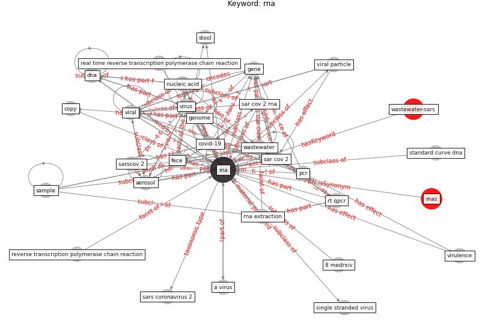

# Keyword: __rna__
## Clusters

* Cluster 1: [wastewater-sars](cluster_1)

## Concepts

 

## Top 10 articles for __rna__
* Detection of SARS-CoV-2 in raw and treated wastewater
in Germany – Suitability for COVID-19 surveillance
and potential transmission risks ([westhaus_detection_2021](article_westhaus_detection_2021))
* First confirmed detection of SARS-CoV-2 in untreated
wastewater in Australia: A proof of concept for the
wastewater surveillance of COVID-19 in the community ([ahmed_first_2020](article_ahmed_first_2020))
* Presence of SARS-Coronavirus-2 RNA in Sewage and
Correlation with Reported COVID-19 Prevalence in
the Early Stage of the Epidemic in The
Netherlands ([medema_presence_2020](article_medema_presence_2020))
* How can airborne transmission of COVID-19 indoors be
minimised? ([morawska_how_2020](article_morawska_how_2020))
* onway-morris_removal_2021 ([onway-morris_removal_2021](article_onway-morris_removal_2021))
* Wastewater surveillance for population-wide Covid-19:
The present and future ([daughton_wastewater_2020](article_daughton_wastewater_2020))
* Graphene-based nanomaterials as antimicrobial surface
coatings: A parallel approach to restrain the expansion
of COVID-19 ([ayub_graphene-based_2021](article_ayub_graphene-based_2021))
* SARS-CoV-2 RNA detection of hospital isolation wards
hygiene monitoring during the Coronavirus Disease 2019
outbreak in a Chinese hospital ([wang_sars-cov-2_2020](article_wang_sars-cov-2_2020))
* Supporting Technologies for COVID-19 Prevention:
Systemized Review ([zhao_supporting_2022](article_zhao_supporting_2022))
* First detection of SARS-CoV-2 in untreated wastewaters
in Italy ([la_rosa_first_2020](article_la_rosa_first_2020))
