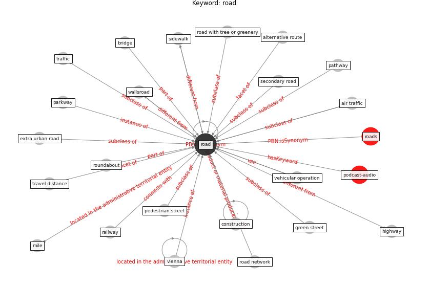

# Keyword: road

* [podcast-audio](cluster_Cluster_7)

## Keywords

 * Cluster_7, air traffic, alternative route, bridge, [construction](keyword_construction), extra urban road, green street, highway, [mile](keyword_mile), parkway, pathway, pedestrian street, railway, [road](keyword_road), road network, road with tree or greenery, roads, roundabout, secondary road, sidewalk, traffic, travel distance, vehicular operation, [vienna](keyword_vienna), wallsroad

## Concepts

 

## Neighbours

### Closest articles

* Association of built environment attributes with the spread of COVID-19 at its initial stage in China - [LINK](article_li_association_2021)
* COVID19-Routes: A Safe Pedestrian Navigation Service - [LINK](article_cantarero_covid19-routes_2021)
* Nurture to nature via COVID-19, a self-regenerating environmental strategy of environment in global context - [LINK](article_paital_nurture_2020)
* A Review on Building Design as a Biomedical System for Preventing COVID-19 Pandemic - [LINK](article_amran_review_2022)
* Retail Signage During the COVID-19 Pandemic - [LINK](article_mcneish_retail_2020)
* Association between indoor-outdoor green features and psychological health during the COVID-19 lockdown in Italy: A cross-sectional nationwide study - [LINK](article_spano_association_2021)
* The Smart City and Covid‐19 - [LINK](article_webb_smart_2020)
* Green spaces, especially forest, linked to lower SARS-CoV-2 infection rates: A one-year nationwide study - [LINK](article_jiang_green_2021)
* COVID-19 Pandemic: Rethinking Strategies for Resilient Urban Design, Perceptions, and Planning - [LINK](article_afrin_covid-19_2021)

### Closest BPs

