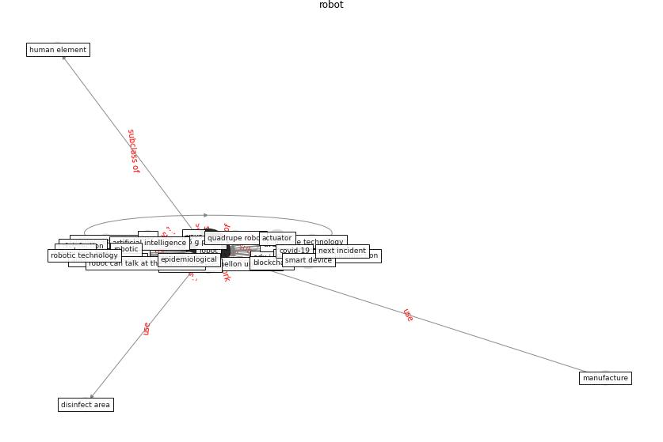

# Keyword: __robot__
## Clusters

* Cluster 1: [datum-health](cluster_1)
* Cluster 6: [smart-iot](cluster_6)

## Concepts

 

## Articles
* A Comprehensive Review of the COVID-19 Pandemic
and the Role of IoT, Drones, AI, Blockchain, and
5G in Managing its Impact ([chamola_comprehensive_2020](article_chamola_comprehensive_2020))
* wang_drones_2020 ([wang_drones_2020](article_wang_drones_2020))
* How the 5G Enabled the COVID-19 Pandemic
Prevention and Control: Materiality, Affordance,
and (De-)Spatialization ([li_how_2022](article_li_how_2022))
* Design COVID-19 Ontology: A Healthcare and
Safety Perspective ([aloulou_design_2022](article_aloulou_design_2022))
* Recently employed engineering techniques to reduce the
spread of COVID-19 (corona virus disease 2019): a review
study ([saman_recently_2021](article_saman_recently_2021))
* Impact of COVID-19 on IoT Adoption in Healthcare,
Smart Homes, Smart Buildings, Smart Cities,
Transportation and Industrial IoT ([umair_impact_2021](article_umair_impact_2021))
* Combating COVID-19—The role of robotics in managing
public health and infectious diseases ([yang_combating_2020](article_yang_combating_2020))
* yan_10_2020 ([yan_10_2020](article_yan_10_2020))
* Supporting Technologies for COVID-19 Prevention:
Systemized Review ([zhao_supporting_2022](article_zhao_supporting_2022))
* ec_views_danish_2020 ([ec_views_danish_2020](article_ec_views_danish_2020))
