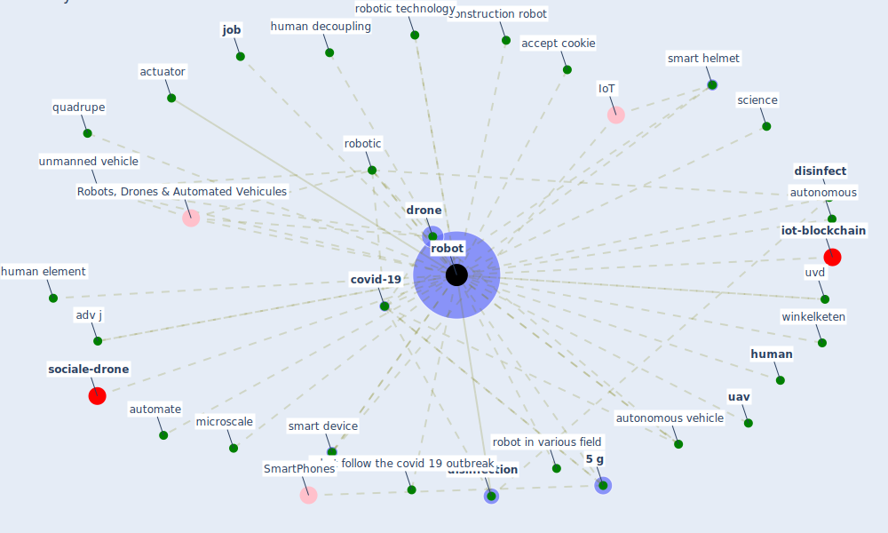

# Keyword: robot

* [iot-blockchain](cluster_6)

* [sociale-drone](cluster_7)

## Keywords

 * 3 cruzr, 3 robotic robot, [5 g](keyword_5_g), 5 g power, Cluster_6, Cluster_7, Robots, Drones & Automated Vehicules, accept cookie, actuator, adv j, [alert](keyword_alert), automate, automatic disinfection robot, automation, autonomous, autonomous vehicle, [blockchain](keyword_blockchain), blue ocean robotic, [build](keyword_build), carnegie mellon university, [china](keyword_china), [clean](keyword_clean), construction robot, [coronavirus](keyword_coronavirus), [covid-19](keyword_covid-19), cruzr, delivery robot, delivery vehicle, disembody, [disinfect](keyword_disinfect), disinfect area, [disinfection](keyword_disinfection), [drone](keyword_drone), drone technology, dynamic, [epidemiological](keyword_epidemiological), face mask, [human](keyword_human), human contact, human decoupling, human element, human to human contact, human worker, [job](keyword_job), [manufacture](keyword_manufacture), microscale, monitor and check the health, next incident, pill delivery robot, quadrupe, quadrupe robot, remotely operate, [robot](keyword_robot), robot automatic disinfection, robot can talk at the same time, robot follow the covid 19 outbreak, robot in various field, [robotic](keyword_robotic), robotic technology, robots, ronavirus fight, science, self drive, [sensor](keyword_sensor), smart device, smart helmet, smart robot, smart technology, talk, temperature measurement, the robot, [uav](keyword_uav), uavs, unmanned vehicle, [uv-c](keyword_uv-c), uvd, winkelketen, [worker](keyword_worker), worker contact with the substance

## Mapping

## Neighbours

### Closest articles

* A Comprehensive Review of the COVID-19 Pandemic and the Role of IoT, Drones, AI, Blockchain, and 5G in Managing its Impact - [LINK](article_chamola_comprehensive_2020)
* How COVID-19 Could Accelerate the Adoption of New Retail Technologies and Enhance the (E-)Servicescape - [LINK](article_willems_how_2021)
* Impact of COVID-19 on IoT Adoption in Healthcare, Smart Homes, Smart Buildings, Smart Cities, Transportation and Industrial IoT - [LINK](article_umair_impact_2021)
* Combating COVID-19—The role of robotics in managing public health and infectious diseases - [LINK](article_yang_combating_2020)
* Recently employed engineering techniques to reduce the spread of COVID-19 (corona virus disease 2019): a review study - [LINK](article_saman_recently_2021)
* Design COVID-19 Ontology: A Healthcare and Safety Perspective - [LINK](article_aloulou_design_2022)
* How the 5G Enabled the COVID-19 Pandemic Prevention and Control: Materiality, Affordance, and (De-)Spatialization - [LINK](article_li_how_2022)
* Drones. Disinfecting robots. Supercomputers. The coronavirus outbreak is a test for China's tech industry \textbar CNN Business - [LINK](article_wang_drones_2020)
* 10 tech trends getting us through the COVID-19 pandemic - [LINK](article_yan_10_2020)
* Supporting Technologies for COVID-19 Prevention: Systemized Review - [LINK](article_zhao_supporting_2022)

### Closest BPs

