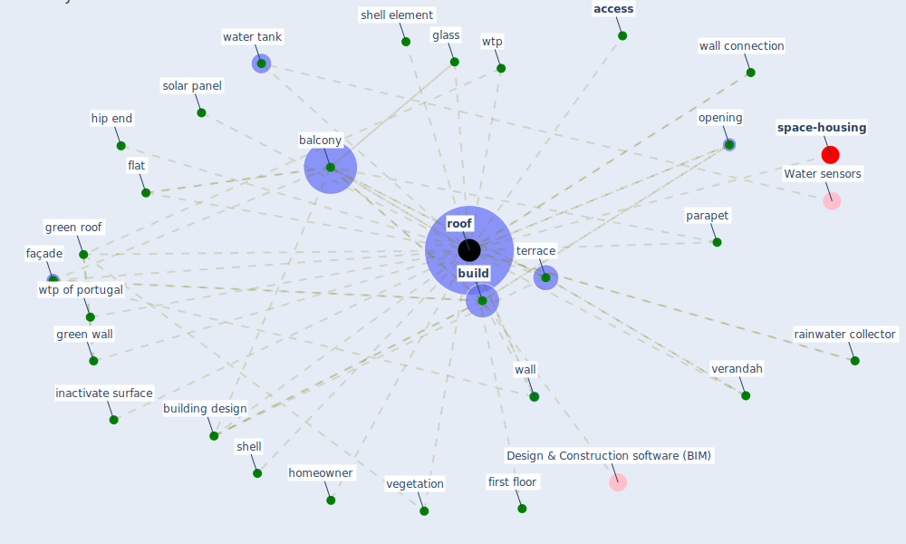

# Keyword: roof

* [space-housing](cluster_4)

## Keywords

 * Cluster_4, [access](keyword_access), [air conditioning](keyword_air_conditioning), air exhaust, air sample facility, [balcony](keyword_balcony), [build](keyword_build), building design, façade, first floor, flat, glass, [green roof](keyword_green_roof), green wall, hip end, homeowner, inactivate surface, light, opening, parapet, rainwater collector, [roof](keyword_roof), roofs, shell, shell element, solar panel, terrace, vegetation, verandah, wall, wall connection, water tank, [wtp](keyword_wtp), wtp of portugal

## Mapping

## Neighbours

### Closest articles

* The role of green roofs in post COVID-19 confinement: An analysis of willingness to pay - [LINK](article_manso_role_2021)
* Towards Resilient Residential Buildings and Neighborhoods in Light of COVID-19 Pandemic—The Scenario of Podgorica, Montenegro - [LINK](article_bojovic_towards_2022)
* COVID-19 Could Leverage a Sustainable Built Environment - [LINK](article_pinheiro_covid-19_2020)
* Designing Post COVID-19 Buildings: Approaches for Achieving Healthy Buildings - [LINK](article_navaratnam_designing_2022)
* Antivirus-built environment: Lessons learned from Covid-19 pandemic - [LINK](article_megahed_antivirus-built_2020)
* Biophilic design in architecture and its contributions to health, well-being, and sustainability: A critical review - [LINK](article_zhong_biophilic_2022)
* How is COVID-19 Experience Transforming Sustainability Requirements of Residential Buildings? A Review - [LINK](article_tokazhanov_how_2020)
* Proximity and post-COVID-19 urban development: Reflections from Milan, Italy - [LINK](article_tricarico_proximity_2021)
* Occupants’ behavior and activity patterns influencing the energy consumption in the Kuwaiti residences - [LINK](article_al-mumin_occupants_2003)
* Toilets dominate environmental detection of SARS-CoV-2 virus in a hospital - [LINK](article_ding_toilets_2020)

### Closest BPs

