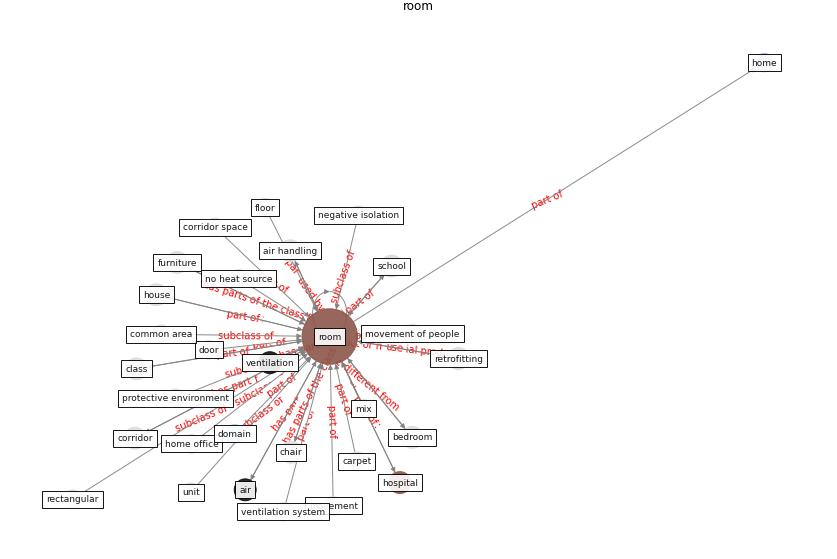

# Keyword: room

* [air-ventilation](cluster_Cluster_4)

* [uv-air](cluster_Cluster_13)

## Keywords

 * Cluster_13, Cluster_4, [air](keyword_air), [air filter](keyword_air_filter), air handling, air sample, air temperature, [anteroom](keyword_anteroom), [apartment](keyword_apartment), banquet, bathroom, [bedroom](keyword_bedroom), breathing zone, [build](keyword_build), carpet, ceiling, ceiling fan, [chair](keyword_chair), class, common area, compartment, confine space, [corridor](keyword_corridor), corridor space, displacement ventilation, [domain](keyword_domain), door, dwell, enclosure, floor, furniture, gapthe, [garden](keyword_garden), heat source, [home](keyword_home), home office, home office space, [hospital](keyword_hospital), hotel, [house](keyword_house), independent isolation room, [indoor](keyword_indoor), indoor location, isolated isolation room, isolation room, live, microbe, mix, mix air distribution, movement, movement of people, negative isolation, no heat source, [occupant](keyword_occupant), open closing window, open window, operating room, optimal arrangement, [patient](keyword_patient), private bathroom, protective environment, rectangular, relative humidity, retrofitting, [room](keyword_room), room air, room air cleaner, room occupancy, rooms, [school](keyword_school), secondary air circulation, secondary air circulation system, [space](keyword_space), space apart, supply air, [toilet](keyword_toilet), underfloor ventilation, unit, ventilate, ventilate building, [ventilation](keyword_ventilation), ventilation flow, ventilation rate, ventilation strategy, [ventilation system](keyword_ventilation_system), washroom, well ventilate, [window](keyword_window)

## Concepts

 

## Neighbours

### Closest articles

* Social distancing enhanced automated optimal design of physical spaces in the wake of the COVID-19 pandemic - [LINK](article_ugail_social_2021)
* Methods for air cleaning and protection of building occupants from airborne pathogens - [LINK](article_bolashikov_methods_2009)
* Review and comparison of HVAC operation guidelines in different countries during the COVID-19 pandemic - [LINK](article_guo_review_2021)
* Air Disinfection for Airborne Infection Control with a Focus on COVID‐19: Why Germicidal UV is Essential             † - [LINK](article_nardell_air_2021)
* Occupants’ behavior and activity patterns influencing the energy consumption in the Kuwaiti residences - [LINK](article_al-mumin_occupants_2003)
* Upper-room ultraviolet air disinfection might help to reduce COVID-19 transmission in buildings: a feasibility study - [LINK](article_beggs_upper-room_2020)
* COVID-19 and Green Housing: A Review of Relevant Literature - [LINK](article_kaklauskas_covid-19_2021)
* COVID-19 Forced Hospitals to Build Negative Pressure Rooms Fast - [LINK](article_dyer_covid-19_2020)
* Building occupancy estimation with people flow modeling in AnyLogic - [LINK](article_li_building_2016)
* Applications of ultraviolet germicidal irradiation disinfection in health care facilities: Effective adjunct, but not stand-alone technology - [LINK](article_memarzadeh_applications_2010)

### Closest BPs

