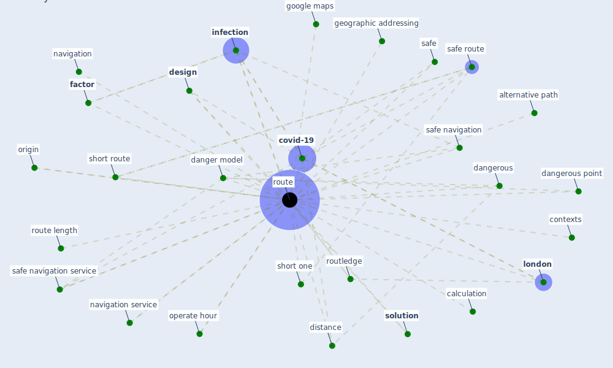

# Keyword: route

## Keywords

 * alternative path, calculation, contexts, [covid-19](keyword_covid-19), [danger model](keyword_danger_model), dangerous, dangerous point, [design](keyword_design), design his route, destination, distance, exit point, [factor](keyword_factor), geographic addressing, google maps, [infection](keyword_infection), [london](keyword_london), navigation, navigation service, operate hour, origin, [route](keyword_route), route length, routes, routing, routledge, safe, safe navigation, safe navigation service, safe route, short one, short route, [solution](keyword_solution), virus transmission

## Mapping

## Neighbours

### Closest articles

* COVID19-Routes: A Safe Pedestrian Navigation Service - [LINK](article_cantarero_covid19-routes_2021)
* Refleksioner fra en pandemi - [LINK](article_realdania_refleksioner_2022)
* How COVID-19 Could Accelerate the Adoption of New Retail Technologies and Enhance the (E-)Servicescape - [LINK](article_willems_how_2021)
* Designing a Multi-Agent Occupant Simulation System to Support Facility Planning and Analysis for COVID-19 - [LINK](article_lee_designing_2021)
* Indoor Air Quality: Rethinking rules of building design strategies in post-pandemic architecture - [LINK](article_megahed_indoor_2021)
* A critical analysis of the impacts of COVID-19 on the global economy and ecosystems and opportunities for circular economy strategies - [LINK](article_ibn-mohammed_critical_2021)
* Borders and Catastrophe: lessons from COVID-19 for the European Green Deal - [LINK](article_klein_borders_2021)
* How can airborne transmission of COVID-19 indoors be minimised? - [LINK](article_morawska_how_2020)
* Mobile Technology Solution for COVID-19: Surveillance and Prevention - [LINK](article_raza_mobile_2021)
* Biophilic design in architecture and its contributions to health, well-being, and sustainability: A critical review - [LINK](article_zhong_biophilic_2022)

### Closest BPs

