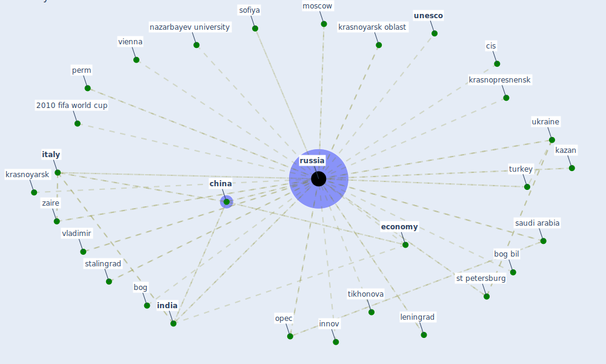

# Keyword: russia

## Keywords

 * 2010 fifa world cup, bog, bog bil, [china](keyword_china), cis, [country](keyword_country), [economy](keyword_economy), equivalent ach, [india](keyword_india), innov, innova, isr, [italy](keyword_italy), kazan, krasnopresnensk, krasnoyarsk, krasnoyarsk oblast, leningrad, maksim chernenko, ministry of science and high education, moscow, nazarbayev university, nenet autonomous okrug, opec, perm, [poland](keyword_poland), [russia](keyword_russia), russian language, san marino, [saudi arabia](keyword_saudi_arabia), sofiya, sputniknew uz, st petersburg, stalingrad, tikhonova, turkey, ukraine, [unesco](keyword_unesco), [vienna](keyword_vienna), vladimir, zaire, zopur, zrt

## Mapping

## Neighbours

### Closest articles

* How COVID-19 Could Accelerate the Adoption of New Retail Technologies and Enhance the (E-)Servicescape - [LINK](article_willems_how_2021)
* Addressing the impact of COVID-19 lockdown on energy use in municipal buildings: A case study in Florianópolis, Brazil - [LINK](article_geraldi_addressing_2021)
* The role of 5G for digital healthcare against COVID-19 pandemic: Opportunities and challenges - [LINK](article_siriwardhana_role_2021)
* Design COVID-19 Ontology: A Healthcare and Safety Perspective - [LINK](article_aloulou_design_2022)
* How the 5G Enabled the COVID-19 Pandemic Prevention and Control: Materiality, Affordance, and (De-)Spatialization - [LINK](article_li_how_2022)
* Health, Wellbeing \& Productivity in Offices - [LINK](article_world_green_building_council_health_2014)
* The socio-economic implications of the coronavirus pandemic (COVID-19): A review - [LINK](article_nicola_socio-economic_2020)
* Refleksioner fra en pandemi - [LINK](article_realdania_refleksioner_2022)
* Readiness Assessment of Green Building Certification Systems for Residential Buildings during Pandemics - [LINK](article_tleuken_readiness_2021)
* COVID19-Routes: A Safe Pedestrian Navigation Service - [LINK](article_cantarero_covid19-routes_2021)

### Closest BPs

