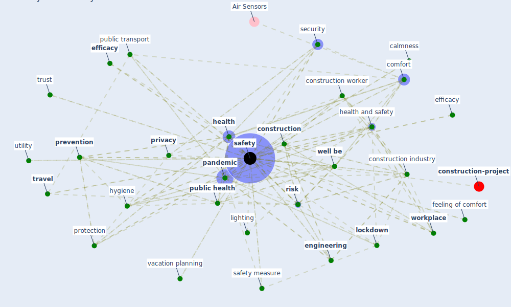

# Keyword: safety

* [construction-project](cluster_8)

## Keywords

 * active travel, air quality, airtight, betkier, building support and safety measure, calmness, [care](keyword_care), change bring on by the pandemic, clean substance, comfort, complaint, concern, [construction](keyword_construction), construction company, [construction industry](keyword_construction_industry), construction site, [construction worker](keyword_construction_worker), consumption, contagious disease, [covid-19](keyword_covid-19), crime, [datum protection](keyword_datum_protection), [disinfect](keyword_disinfect), [disinfection](keyword_disinfection), distance, [efficacy](keyword_efficacy), [efficiency](keyword_efficiency), efficacy, efficiency, [employee](keyword_employee), [engineering](keyword_engineering), ethic, feeling of comfort, finance, [health](keyword_health), [health and safety](keyword_health_and_safety), health and safety category, health at work, health concern, health control, health protection, health risk, health violation, hygiene, inspection, invention, lighting, [lockdown](keyword_lockdown), meter reading, morale, [osha](keyword_osha), [pandemic](keyword_pandemic), [patient](keyword_patient), perception, preparedness, preventative measure, [prevention](keyword_prevention), [privacy](keyword_privacy), protection, [public health](keyword_public_health), [public transport](keyword_public_transport), [risk](keyword_risk), risk of infection, safe, [safety](keyword_safety), safety and wellbeing, safety culture, safety inspection, safety measure, safety perception, safety protocol, safety site supervisor, safety strategy, safety subj security, science, scientific manner, [security](keyword_security), security issue, [signage](keyword_signage), sport equipment, [surveillance](keyword_surveillance), [test](keyword_test), testing, [tourism](keyword_tourism), [travel](keyword_travel), trust, upper room uv, urban transport, utility, [uv-c](keyword_uv-c), vacation planning, [ventilation](keyword_ventilation), welfare, [well be](keyword_well_be), [wellbee](keyword_wellbee), work condition, work environment, [worker](keyword_worker), workout equipment, [workplace](keyword_workplace)

## Mapping

## Neighbours

### Closest articles

* How COVID-19 Could Accelerate the Adoption of New Retail Technologies and Enhance the (E-)Servicescape - [LINK](article_willems_how_2021)
* Mobility Behaviour in View of the Impact of the COVID-19 Pandemic—Public Transport Users in Gdansk Case Study - [LINK](article_przybylowski_mobility_2021)
* Analysis of COVID-19 Concerns Raised by the Construction Workforce and Development of Mitigation Practices - [LINK](article_bou_hatoum_analysis_2021)
* Supporting Technologies for COVID-19 Prevention: Systemized Review - [LINK](article_zhao_supporting_2022)
* Influence between COVID-19 Impacts and Project Stakeholders in Chilean Construction Projects - [LINK](article_araya_influence_2021)
* Assessment of COVID-19 precautionary measures in sports facilities: A case study on a health club in Saudi Arabia - [LINK](article_ibrahim_assessment_2022)
* Should I Stay or Should I Go? Tourists’ COVID-19 Risk Perception and Vacation Behavior Shift - [LINK](article_bratic_should_2021)
* A study on office workplace modification during the COVID-19 pandemic in The Netherlands - [LINK](article_hou_study_2021)
* COVID-19 Experience Transforming the Protective Environment of Office Buildings and Spaces - [LINK](article_phapant_covid-19_2021)
* Strategies to Mitigate COVID-19 Pandemic Impacts on Health and Safety of Workers in Construction Projects - [LINK](article_kaushal_strategies_2021)

### Closest BPs

