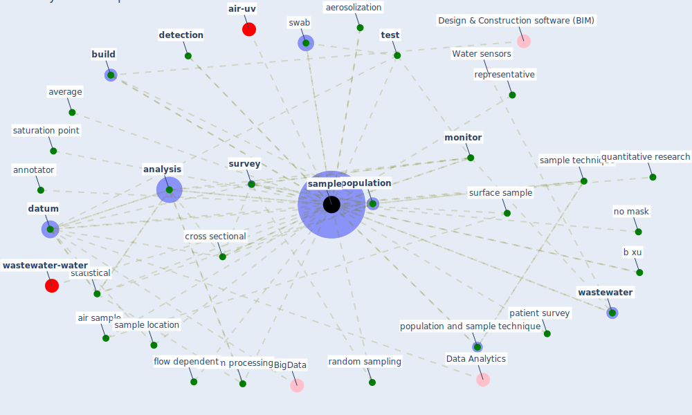

# Keyword: sample

* [wastewater-water](cluster_0)

* [air-uv](cluster_10)

## Keywords

 * 04samples, abundance, aerosolization, [age group](keyword_age_group), [air filter](keyword_air_filter), air sample, [analysis](keyword_analysis), annotator, average, b xu, bcomparison, [build](keyword_build), communication window, condition, coronavirus aerosol, criterion for inclusion, cross sectional, [dataset](keyword_dataset), [datum](keyword_datum), datum processing, [detection](keyword_detection), dilution, distinctive sampling design, easy random sampling, equipment, evaluation, flow dependent, fresh air, gateway device, gather, gathering report, harmonisation, [house](keyword_house), image, impinger, inactive air filter, ketron, key property, labeling process, [monitor](keyword_monitor), no mask, operation, patient survey, peactual, pellet, [population](keyword_population), population and sample technique, pro and con, ptr ms, [quality](keyword_quality), quality of datum, quantitative research, [quarantine](keyword_quarantine), [random](keyword_random), random coefficient, random sampling, randomness, reagent, record, red tick, representative, representative sample, research sample, reuse, [rna](keyword_rna), rna extraction, rt qpcr assay, [sample](keyword_sample), sample condition, sample location, sample stability, sample stability over time, sample technique, sample time, sampled, samples, samplesize, sampling, saturation point, size, snowball sampling, statistical, storage, surface sample, [survey](keyword_survey), swab, swab sample, [system](keyword_system), t test, [test](keyword_test), time integrate, time of delivery, triplicate, uniform distribution, vacuum filter, variable sampling time, voice detection, voluntary response bias, [wastewater](keyword_wastewater), yago

## Mapping

## Neighbours

### Closest articles

* Toilets dominate environmental detection of SARS-CoV-2 virus in a hospital - [LINK](article_ding_toilets_2020)
* A Global Survey of Infection Control and Mitigation Measures for Combating the Transmission of COVID-19 Pandemic in Buildings Under Facilities Management Services - [LINK](article_sarvari_global_2022)
* Construction of a Linked Data Set of COVID-19 Knowledge Graphs: Development and Applications - [LINK](article_wang_construction_2022)
* SARS-CoV-2 Titers in Wastewater Are Higher than Expected from Clinically Confirmed Cases - [LINK](article_wu_sars-cov-2_2020)
* Continuous IEQ monitoring system: Context and development - [LINK](article_parkinson_continuous_2019)
* Scalable IoT Architecture for Monitoring IEQ Conditions in Public and Private Buildings - [LINK](article_calvo_scalable_2022)
* Detection of SARS-CoV-2 in raw and treated wastewater in Germany – Suitability for COVID-19 surveillance and potential transmission risks - [LINK](article_westhaus_detection_2021)
* Aerosol and Surface Distribution of Severe Acute Respiratory Syndrome Coronavirus 2 in Hospital Wards, Wuhan, China, 2020 - [LINK](article_guo_aerosol_2020)
* Effect of Ultraviolet Germicidal Irradiation on Viral Aerosols - [LINK](article_walker_effect_2007)
* The Effects of Pandemic on Construction Industry in the UK - [LINK](article_shibani_effects_2020)

### Closest BPs

