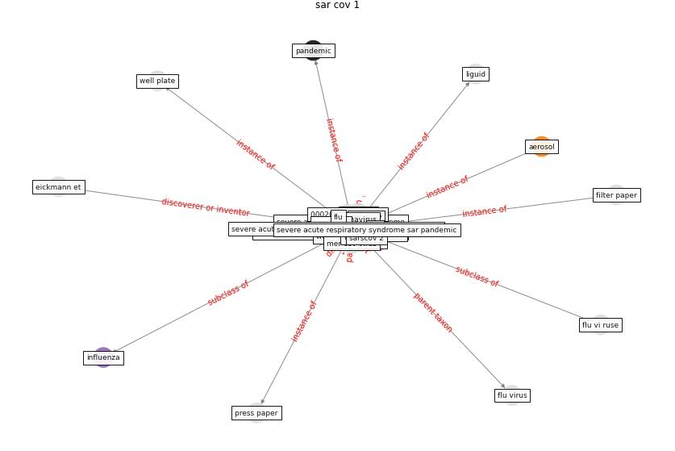

# Keyword: __sar cov 1__

## Concepts

 

## Top articles for __sar cov 1__
* Upper-room ultraviolet air disinfection might help to
reduce COVID-19 transmission in buildings: a feasibility
study ([beggs_upper-room_2020](article_beggs_upper-room_2020))
* Sustainability of Coronavirus on Different
Surfaces ([suman_sustainability_2020](article_suman_sustainability_2020))
* Aerosol and Surface Stability of SARS-CoV-2 as
Compared with SARS-CoV-1 ([van_doremalen_aerosol_2020](article_van_doremalen_aerosol_2020))
