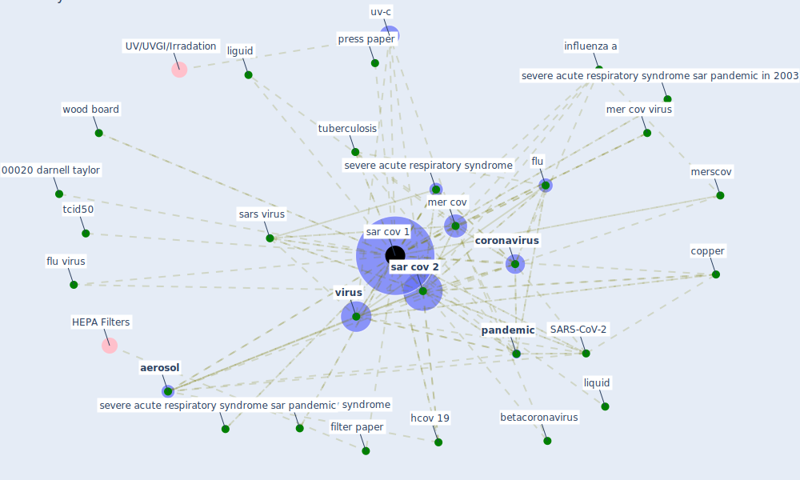

# Keyword: sar cov 1

## Keywords

 * 0 00072 darnell et, 00020 darnell taylor, 00072 darnell et, 2002 2003 sar pandemic, 2003 severe acute respiratory syndrome, SARS-CoV-2, [aerosol](keyword_aerosol), airborne transmission, betacoronavirus, [copper](keyword_copper), [coronavirus](keyword_coronavirus), [covid-19](keyword_covid-19), eickmann et, filter paper, flu, flu vi ruse, flu virus, glass, hcov 19, influenza, influenza a, liguid, liquid, [mer cov](keyword_mer_cov), mer cov virus, merscov, [pandemic](keyword_pandemic), [pathogen](keyword_pathogen), press paper, [sar cov 1](keyword_sar_cov_1), [sar cov 2](keyword_sar_cov_2), sar cov 2 virus, sars cov 1, sars virus, severe acute respiratory syndrome, severe acute respiratory syndrome coronavirus, severe acute respiratory syndrome sar pandemic, severe acute respiratory syndrome sar pandemic in 2003, shase guide, tcid50, [tuberculosis](keyword_tuberculosis), [uv-c](keyword_uv-c), [virus](keyword_virus), virus uv, well plate, wood board

## Mapping

## Neighbours

### Closest articles

* Upper-room ultraviolet air disinfection might help to reduce COVID-19 transmission in buildings: a feasibility study - [LINK](article_beggs_upper-room_2020)
* Environmental factors involved in SARS-CoV-2 transmission: effect and role of indoor environmental quality in the strategy for COVID-19 infection control - [LINK](article_azuma_environmental_2020)
* Sustainability of Coronavirus on Different Surfaces - [LINK](article_suman_sustainability_2020)
* COVID-19 Could Leverage a Sustainable Built Environment - [LINK](article_pinheiro_covid-19_2020)
* Aerosol and Surface Stability of SARS-CoV-2 as Compared with SARS-CoV-1 - [LINK](article_van_doremalen_aerosol_2020)
* Review and comparison of HVAC operation guidelines in different countries during the COVID-19 pandemic - [LINK](article_guo_review_2021)
* COVID-19 Pandemic: Prevention and Protection Measures to Be Adopted at the Workplace - [LINK](article_cirrincione_covid-19_2020)
* Ten questions concerning occupant health in buildings during normal operations and extreme events including the COVID-19 pandemic - [LINK](article_awada_ten_2021)
*  - [LINK](article_dalessandro_covid-19_2020)
* The removal of airborne SARS-CoV-2 and other microbial bioaerosols by air filtration on COVID-19 surge units - [LINK](article_conway-morris_removal_2021)

### Closest BPs

