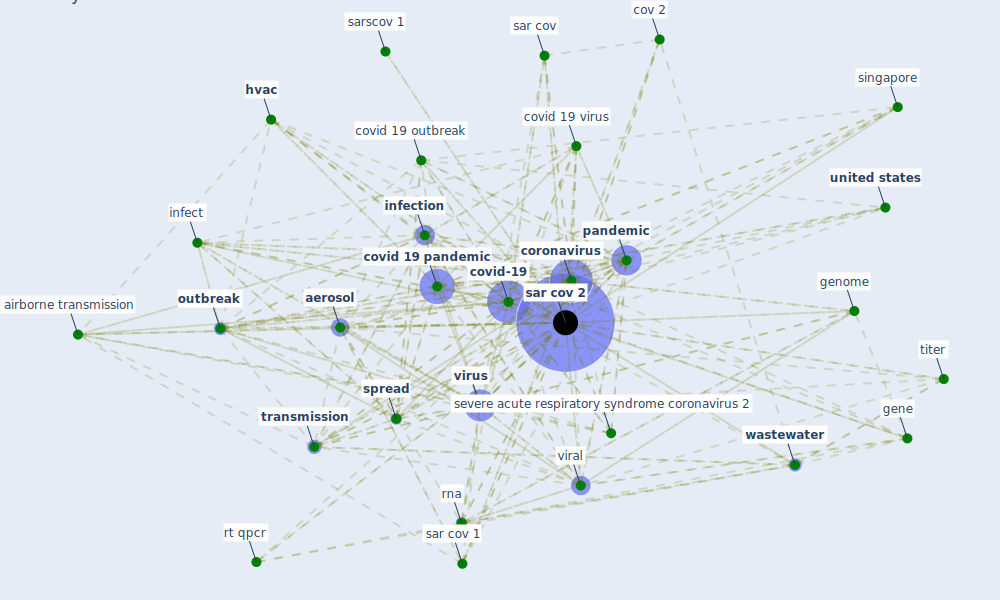

# Keyword: sar cov 2

## Keywords

 * SARS-CoV-2, [aerosol](keyword_aerosol), aerosol transmission, [air](keyword_air), air filtration, [air pollution](keyword_air_pollution), [airborne](keyword_airborne), airborne sar cov 2, airborne transmission, airborne transmission of sar cov 2, antigen, asymptomatic asymptomatic covid 19, [bioaerosol](keyword_bioaerosol), blood plasma, c2, causality, [copper](keyword_copper), [coronavirus](keyword_coronavirus), cov 2, covid 19 coronavirus, covid 19 disease, covid 19 lockdown, covid 19 outbreak, [covid 19 pandemic](keyword_covid_19_pandemic), covid 19 virus, [covid-19](keyword_covid-19), current pandemic, delta strain, deposition, effective heat inactivation, emerge variant, enteric virus, [epidemic](keyword_epidemic), extend lockdown, fomite, [france](keyword_france), [gene](keyword_gene), [genome](keyword_genome), hcov19, hsv1, [hvac](keyword_hvac), [hvac system](keyword_hvac_system), hydroxychloroquine, [icu](keyword_icu), infect, [infection](keyword_infection), infectious, [influenza virus](keyword_influenza_virus), [italy](keyword_italy), [mer cov](keyword_mer_cov), [netherland](keyword_netherland), northern italy, nucleocapsid, nucleocapsid gene, [outbreak](keyword_outbreak), [pandemic](keyword_pandemic), [pathogen](keyword_pathogen), pepper mild mottle virus, positivity, postpandemic period, qrt pcr, rehva, [respiratory](keyword_respiratory), riboflavin nr nr 6 240, rna, rt qpcr, s protein, sar cov, [sar cov 1](keyword_sar_cov_1), [sar cov 2](keyword_sar_cov_2), sar cov 2 rna, sar cov 2 transmission, sarscov 1, seman, severe acute respiratory syndrome, severe acute respiratory syndrome coronavirus, severe acute respiratory syndrome coronavirus 2, [sewage](keyword_sewage), singapore, specific, specific sequence, [spread](keyword_spread), [stainless steel](keyword_stainless_steel), titer, [transmission](keyword_transmission), transmission 7, transmission cluster, two wuhan hospital, [united kingdom](keyword_united_kingdom), [united states](keyword_united_states), upper respiratory tract, [uv](keyword_uv), [uv-c](keyword_uv-c), [vaccine](keyword_vaccine), viability, [viral](keyword_viral), virion, [virus](keyword_virus), [wastewater](keyword_wastewater), [wuhan](keyword_wuhan)

## Mapping

## Neighbours

### Closest articles

* A critical review of heating, ventilation, and air conditioning (HVAC) systems within the context of a global SARS-CoV-2 epidemic - [LINK](article_elsaid_critical_2021)
* Detection of SARS-CoV-2 in raw and treated wastewater in Germany – Suitability for COVID-19 surveillance and potential transmission risks - [LINK](article_westhaus_detection_2021)
* COVID-19 Pandemic: Prevention and Protection Measures to Be Adopted at the Workplace - [LINK](article_cirrincione_covid-19_2020)
* SARS-CoV-2 RNA in wastewater anticipated COVID-19 occurrence in a low prevalence area - [LINK](article_randazzo_sars-cov-2_2020)
* Environmental factors involved in SARS-CoV-2 transmission: effect and role of indoor environmental quality in the strategy for COVID-19 infection control - [LINK](article_azuma_environmental_2020)
* The removal of airborne SARS-CoV-2 and other microbial bioaerosols by air filtration on COVID-19 surge units - [LINK](article_conway-morris_removal_2021)
* Current knowledge of COVID-19: Advances, challenges and future perspectives - [LINK](article_wu_current_2021)
* Upper-room ultraviolet air disinfection might help to reduce COVID-19 transmission in buildings: a feasibility study - [LINK](article_beggs_upper-room_2020)
* Green spaces, especially forest, linked to lower SARS-CoV-2 infection rates: A one-year nationwide study - [LINK](article_jiang_green_2021)
* COVID-19 Prevention and Control Measures in Workplace Settings: A Rapid Review and Meta-Analysis - [LINK](article_ingram_covid-19_2021)

### Closest BPs

