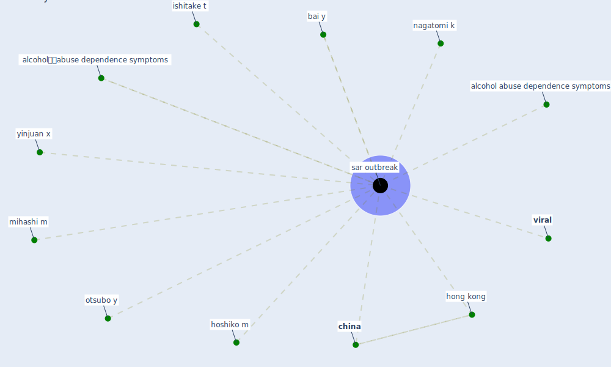

# Keyword: sar outbreak

## Keywords

 * alcohol abuse dependence symptoms, alcoholークabuse dependence symptoms, bai y, [china](keyword_china), [hong kong](keyword_hong_kong), hoshiko m, ishitake t, mihashi m, nagatomi k, otsubo y, [sar outbreak](keyword_sar_outbreak), sars outbreak, sars outbreaks, [viral](keyword_viral), yinjuan x

## Mapping

## Neighbours

### Closest articles

* The psychological impact of COVID-19 on the mental health in the general population - [LINK](article_serafini_psychological_2020)
* ASHRAE Position Document on Infectious Aerosols - [LINK](article_ashrae_ashrae_2022)
* COVID-19 Pandemic: Prevention and Protection Measures to Be Adopted at the Workplace - [LINK](article_cirrincione_covid-19_2020)

### Closest BPs

