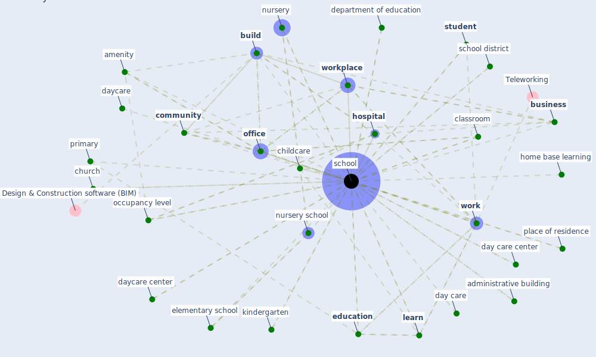

# Keyword: school

## Keywords

 * access to education, administrative building, [amenity](keyword_amenity), auditorium, back in session, boy, brooks, [build](keyword_build), [building](keyword_building), building process, building type, [business](keyword_business), [child](keyword_child), child care, child s performance, child s performance in school, childcare, church, classroom, clermont ferrand, code for design of school, college, [community](keyword_community), [construction](keyword_construction), [courtyard](keyword_courtyard), covid 19 lockdown, [covid 19 pandemic](keyword_covid_19_pandemic), day care, day care center, daycare, daycare center, daycare centre, department of education, diploma, disengagement, dormitory, educate, [education](keyword_education), [educator](keyword_educator), elementary, [elementary school](keyword_elementary_school), england, five room, free, health center, high occupancy area, home base learning, [hospital](keyword_hospital), [indoor air quality](keyword_indoor_air_quality), kindergarten, [learn](keyword_learn), nursery, [nursery school](keyword_nursery_school), occupancy level, [office](keyword_office), place of residence, [policy](keyword_policy), post secondary, primary, [public place](keyword_public_place), public service, [public space](keyword_public_space), pupil performance, [quality](keyword_quality), reception, [region](keyword_region), [room](keyword_room), [school](keyword_school), school break, school bus, school district, school facility, school of architecture in clermont ferrand, school start time, schoolchildren, schooling, schools, schoolschool, sdg 4 quality, [service](keyword_service), set, specific, specific relevant service, start time, [student](keyword_student), student arrive, student learn routine, summer vacation, [test](keyword_test), test period, toronto publichealth, university education, [ventilation](keyword_ventilation), [work](keyword_work), [work base learn](keyword_work_base_learn), work place, [workplace](keyword_workplace), year one, year six, youth centre

## Mapping

## Neighbours

### Closest articles

* The socio-economic determinants of COVID-19: A spatial analysis of German county level data - [LINK](article_ehlert_socio-economic_2021)
* COVID19-Routes: A Safe Pedestrian Navigation Service - [LINK](article_cantarero_covid19-routes_2021)
* Addressing the impact of COVID-19 lockdown on energy use in municipal buildings: A case study in Florianópolis, Brazil - [LINK](article_geraldi_addressing_2021)
* Designing for COVID-2x: Reflecting on Future-Proofing Human Habitation for the Inevitable Next Pandemic - [LINK](article_spennemann_designing_2022)
* Ten questions concerning occupant health in buildings during normal operations and extreme events including the COVID-19 pandemic - [LINK](article_awada_ten_2021)
* World Bank Development Report - [LINK](article_world_bank_world_2022)
* Knowledge, attitudes, and practices of Indonesian residents regarding COVID-19: A national cross-sectional survey - [LINK](article_yodang_knowledge_2021)
* The ventilation of buildings and other mitigating measures for COVID-19: a focus on wintertime - [LINK](article_burridge_ventilation_2021)
* Impacts of COVID-19 on residential building energy use and performance - [LINK](article_kawka_impacts_2021)
* COVID-19 Could Leverage a Sustainable Built Environment - [LINK](article_pinheiro_covid-19_2020)

### Closest BPs

