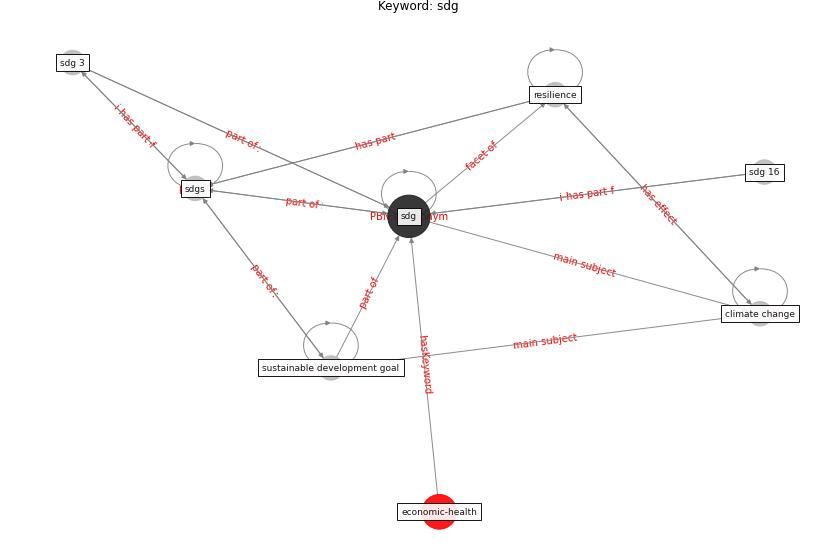

# Keyword: sdg

* [economic-health](cluster_Cluster_9)

## Keywords

 * Cluster_9, [climate change](keyword_climate_change), [resilience](keyword_resilience), [sdg](keyword_sdg), sdg 16, sdg 3, [sdgs](keyword_sdgs), [sustainable development goal](keyword_sustainable_development_goal)

## Concepts

 

## Neighbours

### Closest articles

* COVID-19: IMPACT OF THE PANDEMIC ON THE SUSTAINABLE DEVELOPMENT GOALS - [LINK](article_samout_covid-19_2020)
* COVID-19 and the UN Sustainable Development Goals: Threat to Solidarity or an Opportunity? - [LINK](article_leal_filho_covid-19_2020)
* Urban planning after COVID-19 - [LINK](article_rtpi_urban_2021)
* COVID-19 risks and systemic gaps in Nigeria: resilience building lessons for pandemic and climate change management - [LINK](article_lawal_covid-19_2022)
* Strengthening resilience: a priority shared by Health 2020 and - [LINK](article_who_strengthening_2017)

### Closest BPs

