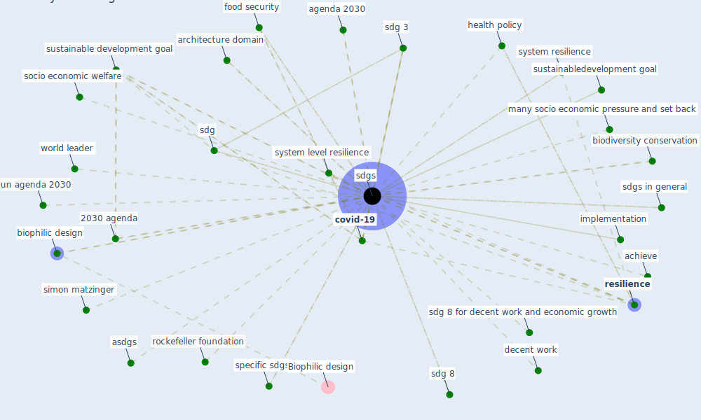

# Keyword: sdgs

## Keywords

 * 2030 agenda, achieve, agenda 2030, architecture domain, asdgs, biodiversity conservation, [biophilic design](keyword_biophilic_design), [covid-19](keyword_covid-19), decent work, [ecosystem](keyword_ecosystem), food security, good health, health policy, implementation, many socio economic pressure and set back, [policy](keyword_policy), poverty, [resilience](keyword_resilience), rockefeller foundation, sdg, sdg 3, sdg 8, sdg 8 for decent work and economic growth, [sdgs](keyword_sdgs), sdgs in general, simon matzinger, socio economic welfare, specific sdgs, [sustainable architecture](keyword_sustainable_architecture), [sustainable development](keyword_sustainable_development), sustainable development agenda, [sustainable development goal](keyword_sustainable_development_goal), sustainabledevelopment goal, system level, system level resilience, system resilience, un agenda 2030, [united nations](keyword_united_nations), [world bank](keyword_world_bank), world leader

## Mapping

## Neighbours

### Closest articles

* COVID-19 and the UN Sustainable Development Goals: Threat to Solidarity or an Opportunity? - [LINK](article_leal_filho_covid-19_2020)
* Strengthening resilience: a priority shared by Health 2020 and - [LINK](article_who_strengthening_2017)
* COVID-19: IMPACT OF THE PANDEMIC ON THE SUSTAINABLE DEVELOPMENT GOALS - [LINK](article_samout_covid-19_2020)
* Biophilic design in architecture and its contributions to health, well-being, and sustainability: A critical review - [LINK](article_zhong_biophilic_2022)
* Building up an ecologically sustainable and socially desirable post-COVID-19 future - [LINK](article_duflot_building_2021)
* Urban planning after COVID-19 - [LINK](article_rtpi_urban_2021)
* A critical analysis of the impacts of COVID-19 on the global economy and ecosystems and opportunities for circular economy strategies - [LINK](article_ibn-mohammed_critical_2021)
* The COVID-19 pandemic: Lessons on building more equal and sustainable societies - [LINK](article_van_barneveld_covid-19_2020)
* Contextualizing the Covid-19 pandemic for a carbon-constrained world: Insights for sustainability transitions, energy justice, and research methodology - [LINK](article_sovacool_contextualizing_2020)
* Covid-19 and the politics of sustainable energy transitions - [LINK](article_kuzemko_covid-19_2020)

### Closest BPs

