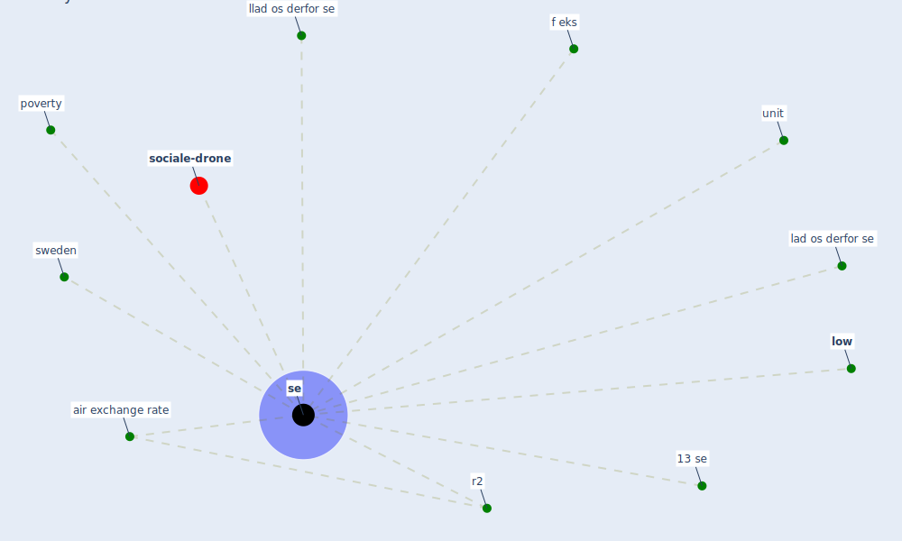

# Keyword: se

* [sociale-drone](cluster_6)

## Keywords

 * 13 se, Cluster_6, air exchange rate, f eks, lad os derfor se, llad os derfor se, [low](keyword_low), poverty, r2, [se](keyword_se), ses, [sweden](keyword_sweden), unit

## Mapping

## Neighbours

### Closest articles

* Refleksioner fra en pandemi - [LINK](article_realdania_refleksioner_2022)
* The Effect of Opening Windows on Air Change Rates in Two Homes - [LINK](article_howard-reed_effect_2002)
* Decision Making within the Built Environment as a Strategy for Mitigating the Risk of Malaria and Other Vector-Borne Diseases - [LINK](article_obonyo_decision_2018)
* Housing Experience in Gated Communities in the Time of Pandemics: Lessons Learned from COVID-19 - [LINK](article_asfour_housing_2022)
* World Bank Development Report - [LINK](article_world_bank_world_2022)

### Closest BPs

