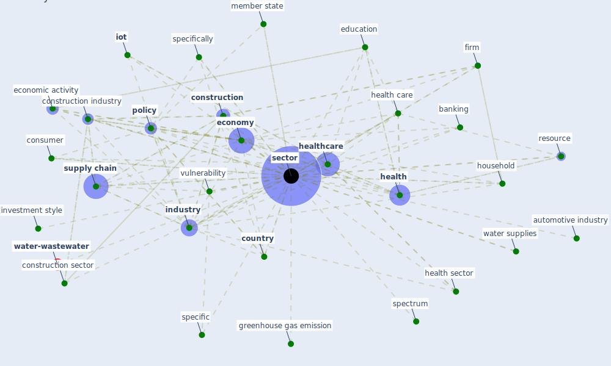

# Keyword: sector

* [water-wastewater](cluster_7)

## Keywords

 * Cluster_7, airline industry, aquaculture, asset class, automobile, automotive industry, banking, [business](keyword_business), co benefits, commercial, [construction](keyword_construction), [construction industry](keyword_construction_industry), construction sector, [consumer](keyword_consumer), [country](keyword_country), creative, criticality, deposit banking, deposit banking industry, deposit banking sector, disci pline, discus pline, [economic](keyword_economic), economic activity, [economy](keyword_economy), [ecosystem](keyword_ecosystem), edificación en españa, [education](keyword_education), employment, [energy consumption](keyword_energy_consumption), [engineer](keyword_engineer), expert opinion, firm, food industry, global, [government](keyword_government), [green housing](keyword_green_housing), green housing research community, greenhouse gas emission, [health](keyword_health), [health care](keyword_health_care), health care facility, health policy, health profession, health sector, [healthcare](keyword_healthcare), [healthcare system](keyword_healthcare_system), [household](keyword_household), [industry](keyword_industry), investment style, [iot](keyword_iot), [manufacture](keyword_manufacture), marginalize community, [member state](keyword_member_state), methodology, micro small and medium size enterprise, microfinance, msme, non cyclical, occupation, [office](keyword_office), office sector, [organisation](keyword_organisation), [policy](keyword_policy), precarious work, profit center, public health care, public sector, public service employment and unia, publication, research community, research direction, resource, retail, retail sector, rural, secondary, [sector](keyword_sector), sectors, [social](keyword_social), [society](keyword_society), socio economic, specific, specifically, spectrum, [supply chain](keyword_supply_chain), [technology](keyword_technology), textile, [tourism](keyword_tourism), [transport](keyword_transport), transport sector, transportation, [tvet](keyword_tvet), urban health, [urban planning](keyword_urban_planning), [vulnerability](keyword_vulnerability), [water](keyword_water), water supplies, woman own business, [work base learn](keyword_work_base_learn)

## Mapping

## Neighbours

### Closest articles

* World Bank Development Report - [LINK](article_world_bank_world_2022)
* Revisiting the built environment: 10 potential development changes and paradigm shifts due to COVID-19 - [LINK](article_cheshmehzangi_revisiting_2021)
* Impact of COVID-19 on IoT Adoption in Healthcare, Smart Homes, Smart Buildings, Smart Cities, Transportation and Industrial IoT - [LINK](article_umair_impact_2021)
* How COVID-19 Could Accelerate the Adoption of New Retail Technologies and Enhance the (E-)Servicescape - [LINK](article_willems_how_2021)
* Covid-19 and asset management in EU: a preliminary assessment of performance and investment styles - [LINK](article_rizvi_covid-19_2020)
* Contributions of Smart City Solutions and Technologies to Resilience against the COVID-19 Pandemic: A Literature Review - [LINK](article_sharifi_contributions_2021)
* Challenges to Mitigating the Urban Health Burden of Mosquito-Borne Diseases in the Face of Climate Change - [LINK](article_ligsay_challenges_2021)
* Borders and Catastrophe: lessons from COVID-19 for the European Green Deal - [LINK](article_klein_borders_2021)
* Sustainable work throughout the life course: National policies and strategies, Publications Office of the European Union - [LINK](article_eurofund_sustainable_2016)
* Urban planning after COVID-19 - [LINK](article_rtpi_urban_2021)

### Closest BPs

