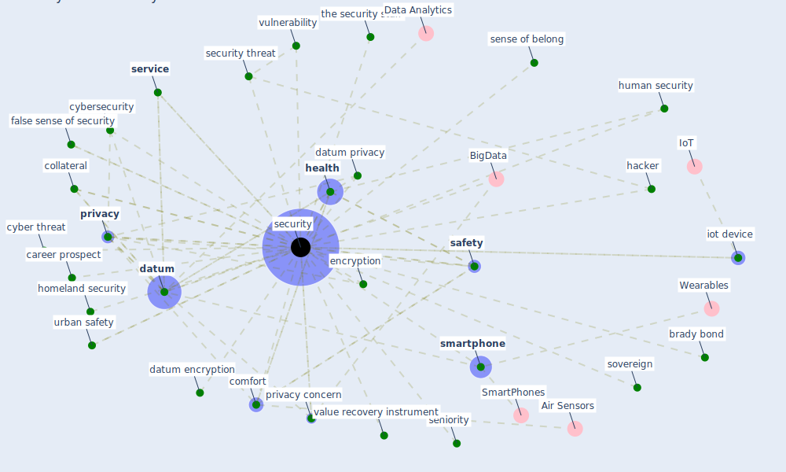

# Keyword: security

## Keywords

 * access control, [blockchain](keyword_blockchain), brady bond, career prospect, chain of virus, collateral, collateralization, comfort, cyber security, cyber threat, cybersecurity, [datum](keyword_datum), datum collec tion, datum collec tion and storage privacy, datum collec tion and storage privacy design principle and protocol, datum encryption, datum privacy, [datum protection](keyword_datum_protection), employment protection, encryption, executive coach, false sense of security, fragility, globalization, hacker, [health](keyword_health), homeland security, [human](keyword_human), human security, humanitarian, investment, iot device, issue, most pressing one, [network](keyword_network), ontario, ontological, [pandemic](keyword_pandemic), police, [policy](keyword_policy), policy and protocol, [privacy](keyword_privacy), privacy concern, privacy preservation, refuge, [safety](keyword_safety), secure, securities, [security](keyword_security), security challenge, security focus, security threat, security vulnerability, seniority, sense of belong, [service](keyword_service), smart and safe city, [smartphone](keyword_smartphone), soundproof, sovereign, [surveillance](keyword_surveillance), the security staff, urban safety, us treasury bond, value recovery instrument, [virus](keyword_virus), [vulnerability](keyword_vulnerability), wireless networking

## Mapping

## Neighbours

### Closest articles

* The Emergence of Anti-Privacy and Control at the Nexus between the Concepts of Safe City and Smart City - [LINK](article_allam_emergence_2019)
* World Bank Development Report - [LINK](article_world_bank_world_2022)
* Mobile Technology Solution for COVID-19: Surveillance and Prevention - [LINK](article_raza_mobile_2021)
* A Comprehensive Review of the COVID-19 Pandemic and the Role of IoT, Drones, AI, Blockchain, and 5G in Managing its Impact - [LINK](article_chamola_comprehensive_2020)
* The role of 5G for digital healthcare against COVID-19 pandemic: Opportunities and challenges - [LINK](article_siriwardhana_role_2021)
* On the Coronavirus (COVID-19) Outbreak and the Smart City Network: Universal Data Sharing Standards Coupled with Artificial Intelligence (AI) to Benefit Urban Health Monitoring and Management - [LINK](article_allam_coronavirus_2020)
* Leveraging Digital Transformation Technologies to Tackle COVID-19: Proposing a Privacy-First Holistic Framework - [LINK](article_arpaci_leveraging_2021)
* Assessment of COVID-19 precautionary measures in sports facilities: A case study on a health club in Saudi Arabia - [LINK](article_ibrahim_assessment_2022)
* COVID-19 and Green Housing: A Review of Relevant Literature - [LINK](article_kaklauskas_covid-19_2021)
* COVID-19 Experience Transforming the Protective Environment of Office Buildings and Spaces - [LINK](article_phapant_covid-19_2021)

### Closest BPs

