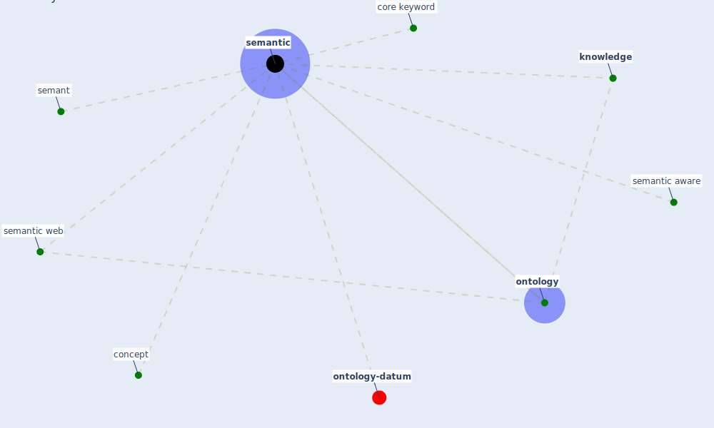

# Keyword: semantic

* [ontology-datum](cluster_12)

## Keywords

 * Cluster_12, concept, core keyword, [knowledge](keyword_knowledge), [ontology](keyword_ontology), semant, [semantic](keyword_semantic), semantic aware, semantic web, semantics

## Mapping

## Neighbours

### Closest articles

* Construction of a Linked Data Set of COVID-19 Knowledge Graphs: Development and Applications - [LINK](article_wang_construction_2022)
* An Overview of Biomedical Ontologies for Pandemics and Infectious Diseases Representation - [LINK](article_bayoudhi_overview_2021)
* CIDO, a community-based ontology for coronavirus disease knowledge and data integration, sharing, and analysis - [LINK](article_he_cido_2020)
* COVID-19 and Green Housing: A Review of Relevant Literature - [LINK](article_kaklauskas_covid-19_2021)
* Impact of COVID-19 on IoT Adoption in Healthcare, Smart Homes, Smart Buildings, Smart Cities, Transportation and Industrial IoT - [LINK](article_umair_impact_2021)

### Closest BPs

