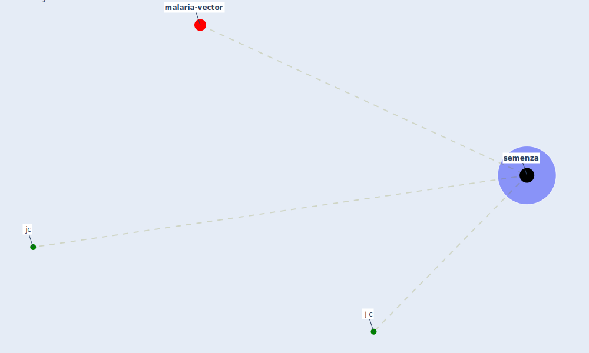

# Keyword: semenza

* [malaria-vector](cluster_13)

## Keywords

 * Cluster_13, j c, jc, [semenza](keyword_semenza)

## Mapping

## Neighbours

### Closest articles

* Addressing vulnerability, building resilience: community-based adaptation to vector-borne diseases in the context of global change - [LINK](article_bardosh_addressing_2017)
* Prototype Early Warning Systems for Vector-Borne Diseases in Europe - [LINK](article_semenza_prototype_2015)

### Closest BPs

