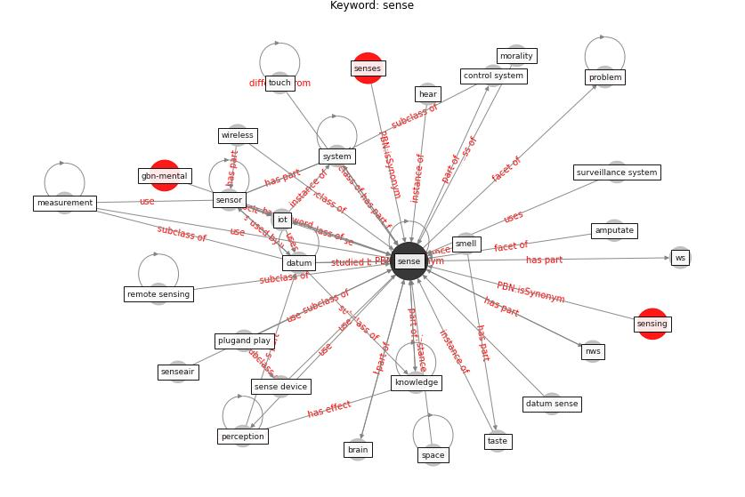

# Keyword: sense

* [gbn-mental](cluster_Cluster_0)

## Keywords

 * Cluster_0, advanced surveillance system, amputate, [biosensor](keyword_biosensor), brain, [control](keyword_control), control system, [datum](keyword_datum), datum analytic, datum sense, fun, [health](keyword_health), hear, [iot](keyword_iot), [knowledge](keyword_knowledge), learn, market, measurement, [mhealth](keyword_mhealth), morality, node, nws, opportunity, perception, plugand play, problem, remote sensing, [sense](keyword_sense), sense device, senseair, senses, sensing, [sensor](keyword_sensor), smell, [space](keyword_space), surveillance system, [system](keyword_system), taste, touch, wireless, ws, wsn

## Concepts

 

## Neighbours

### Closest articles

* How COVID-19 Could Accelerate the Adoption of New Retail Technologies and Enhance the (E-)Servicescape - [LINK](article_willems_how_2021)
* Ten questions concerning occupant health in buildings during normal operations and extreme events including the COVID-19 pandemic - [LINK](article_awada_ten_2021)
* Impact of COVID-19 on IoT Adoption in Healthcare, Smart Homes, Smart Buildings, Smart Cities, Transportation and Industrial IoT - [LINK](article_umair_impact_2021)
* A comprehensive review on indoor air quality monitoring systems for enhanced public health - [LINK](article_saini_comprehensive_2020)
* Continuous IEQ monitoring system: Context and development - [LINK](article_parkinson_continuous_2019)
* Health, Wellbeing \& Productivity in Offices - [LINK](article_world_green_building_council_health_2014)
* Future perspectives of wastewater-based epidemiology: Monitoring infectious disease spread and resistance to the community level - [LINK](article_sims_future_2020)
* Smart cities and a data-driven response to COVID-19 - [LINK](article_james_smart_2020)
* The Intelligent Lockdown: Compliance with COVID-19 Mitigation Measures in the Netherlands - [LINK](article_kuiper_intelligent_2020)

### Closest BPs

