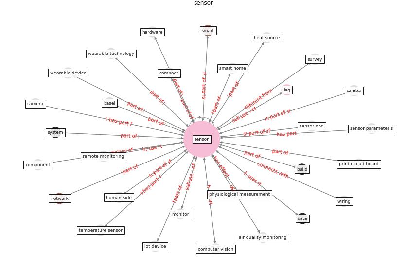

# Keyword: sensor

* [ieq-building](cluster_Cluster_11)

## Keywords

 * a d analog, actuator, air quality monitoring, basel, [big datum](keyword_big_datum), [biomarker](keyword_biomarker), [biosensor](keyword_biosensor), calibrate, calibration, [camera](keyword_camera), campbell, cloud connectivity, compact, component, computer system, [computer vision](keyword_computer_vision), css811, [datum](keyword_datum), datum processing, [dbaf](keyword_dbaf), detector, device, digital, door, driver assistance system, [drone](keyword_drone), eco 2, eco2, field measurement, hardware, health assessment, heat source, home automation, human side, [ibem](keyword_ibem), [ieq](keyword_ieq), infrare, instrument, interface, [internet of thing](keyword_internet_of_thing), [iot](keyword_iot), iot device, j sensor, [kalman filter](keyword_kalman_filter), ket, light, light sensor, [location](keyword_location), low cost, measure box, measurement, meter, microcontroller, [monitor](keyword_monitor), monitor protocol, monitor unit, motion sensor, [mqtt](keyword_mqtt), network, node, [noise](keyword_noise), pcb, pm10, power sensor, print circuit board, prototype, prototype node, raspberry pi, reference sensor, relative humidity, remote monitoring, remote transmission, reset, [samba](keyword_samba), self drive robot, sense, [sensor](keyword_sensor), sensor basel, sensor nod, sensor parameter s, [smart](keyword_smart), [smart building](keyword_smart_building), smart device, smart home, [smart ieq](keyword_smart_ieq), smart meter, smart sensor, [system](keyword_system), [temperature](keyword_temperature), thermometer, tmp37, trackers, tvoc, type, uwb, voc, wearable, wearable device, wearable technology, wireless

## Concepts

 

## Neighbours

### Closest articles

* Scalable IoT Architecture for Monitoring IEQ Conditions in Public and Private Buildings - [LINK](article_calvo_scalable_2022)
* An Intelligent IEQ Monitoring and Feedback System: Development and Applications - [LINK](article_geng_intelligent_2021)
* A comprehensive review on indoor air quality monitoring systems for enhanced public health - [LINK](article_saini_comprehensive_2020)
* Continuous IEQ monitoring system: Context and development - [LINK](article_parkinson_continuous_2019)
* Impact of COVID-19 on IoT Adoption in Healthcare, Smart Homes, Smart Buildings, Smart Cities, Transportation and Industrial IoT - [LINK](article_umair_impact_2021)
* Ten questions concerning occupant health in buildings during normal operations and extreme events including the COVID-19 pandemic - [LINK](article_awada_ten_2021)
* The Emergence of Anti-Privacy and Control at the Nexus between the Concepts of Safe City and Smart City - [LINK](article_allam_emergence_2019)
* Assessment of Building Automation and Control Systems in Danish Healthcare Facilities in the COVID-19 Era - [LINK](article_pedersen_assessment_2022)
* An Automated System to Limit COVID-19 Using Facial Mask Detection in Smart City Network - [LINK](article_rahman_automated_2020)
* Characterization and performance evaluation of a full-scale activated carbon-based dynamic botanical air filtration system for improving indoor air quality - [LINK](article_wang_characterization_2011)

### Closest BPs

