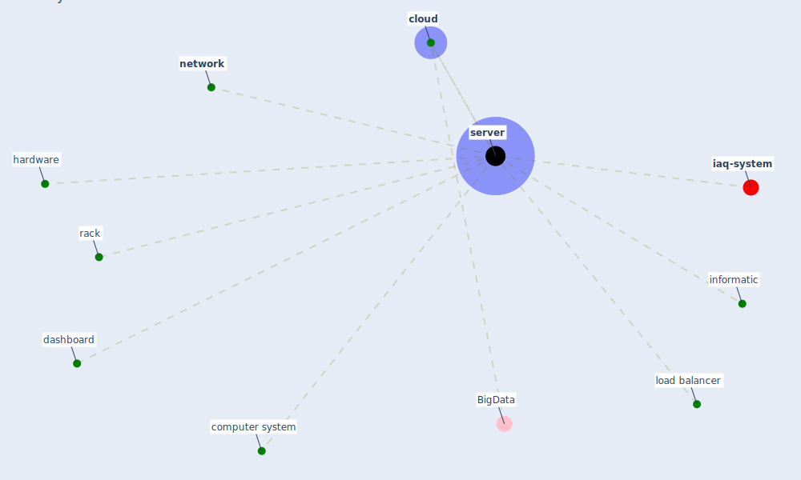

# Keyword: server

* [iaq-system](cluster_3)

## Keywords

 * Cluster_3, [cloud](keyword_cloud), computer system, dashboard, hardware, informatic, load balancer, [network](keyword_network), rack, [server](keyword_server), servers

## Mapping

## Neighbours

### Closest articles

* Continuous IEQ monitoring system: Context and development - [LINK](article_parkinson_continuous_2019)
* Addressing the impact of COVID-19 lockdown on energy use in municipal buildings: A case study in Florianópolis, Brazil - [LINK](article_geraldi_addressing_2021)
* Propositions for a Resilient, Post-COVID-19 Future for the AEC Industry - [LINK](article_nassereddine_propositions_2021)
* The Emergence of Anti-Privacy and Control at the Nexus between the Concepts of Safe City and Smart City - [LINK](article_allam_emergence_2019)
* A comprehensive review on indoor air quality monitoring systems for enhanced public health - [LINK](article_saini_comprehensive_2020)
* Challenges of data sharing in European Covid-19 projects: A learning opportunity for advancing pandemic preparedness and response - [LINK](article_tacconelli_challenges_2022)

### Closest BPs

