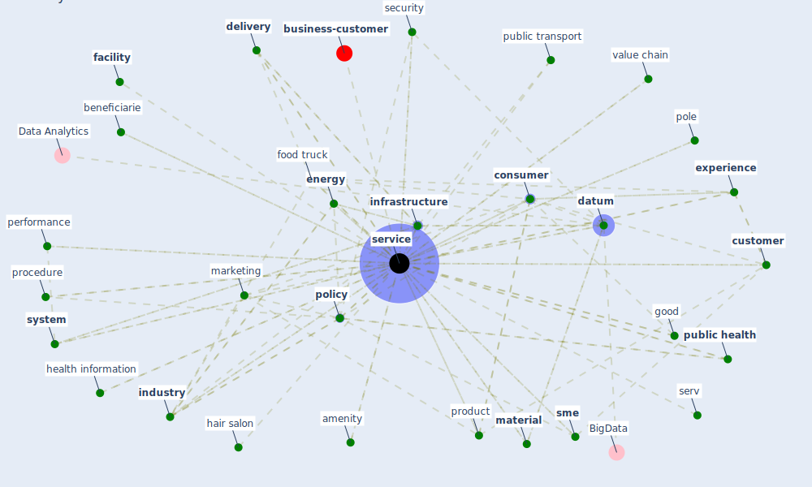

# Keyword: service

* [business-customer](cluster_11)

## Keywords

 * 144 ö, [access](keyword_access), [amenity](keyword_amenity), beneficiarie, [business](keyword_business), [cloud](keyword_cloud), cloud computing, co creation, communication, communication service, community service, [consumer](keyword_consumer), [contract](keyword_contract), convenience, [customer](keyword_customer), [datum](keyword_datum), [delivery](keyword_delivery), e commerce, [economy](keyword_economy), [ecosystem](keyword_ecosystem), ecosystem service, [employee](keyword_employee), [energy](keyword_energy), [energy consumption](keyword_energy_consumption), energy system, [experience](keyword_experience), export, [facility](keyword_facility), [factory](keyword_factory), food, food truck, good, hair salon, hardware, health facility, health information, [healthcare](keyword_healthcare), hospitality, [industry](keyword_industry), [infrastructure](keyword_infrastructure), interactivity, intermediate, [marketing](keyword_marketing), [material](keyword_material), [need](keyword_need), [network](keyword_network), [non contact interaction](keyword_non_contact_interaction), operate hour, [per](keyword_per), performance, [platform](keyword_platform), pole, [policy](keyword_policy), procedure, product, product development, provider customer interaction, [public health](keyword_public_health), public health programme, public service, [public transport](keyword_public_transport), queue, ratio, reciprocity, relational, research priority, restaurant, retail, retail sector, [risk](keyword_risk), [security](keyword_security), self dependence, self dependent, serv, [service](keyword_service), service efficiency, service experience co, service industry, service provider, service provision, service sme, service system, [shop](keyword_shop), [sme](keyword_sme), software, space available for service, specification, strategic agility, strategic sensitivity, [supply](keyword_supply), [system](keyword_system), [technology](keyword_technology), [tourism](keyword_tourism), [transport](keyword_transport), transportation infrastructure, urllc, utility, value chain, [water](keyword_water), water utility

## Mapping

## Neighbours

### Closest articles

* How COVID-19 Could Accelerate the Adoption of New Retail Technologies and Enhance the (E-)Servicescape - [LINK](article_willems_how_2021)
* Urban Community Sustainable Development Patterns under the Influence of COVID-19: A Case Study Based on the Non-Contact Interaction Perspective of Hangzhou City - [LINK](article_wang_urban_2021)
* World Bank Development Report - [LINK](article_world_bank_world_2022)
* COVID-19 and a new resilient infrastructure landscape - [LINK](article_oecd_covid-19_2021)
* Addressing the impact of COVID-19 lockdown on energy use in municipal buildings: A case study in Florianópolis, Brazil - [LINK](article_geraldi_addressing_2021)
* COVID-19 Could Leverage a Sustainable Built Environment - [LINK](article_pinheiro_covid-19_2020)
* Urban planning after COVID-19 - [LINK](article_rtpi_urban_2021)
* Health, Wellbeing \& Productivity in Offices - [LINK](article_world_green_building_council_health_2014)
* An Overview of Biomedical Ontologies for Pandemics and Infectious Diseases Representation - [LINK](article_bayoudhi_overview_2021)
* Assessment of Building Automation and Control Systems in Danish Healthcare Facilities in the COVID-19 Era - [LINK](article_pedersen_assessment_2022)

### Closest BPs

