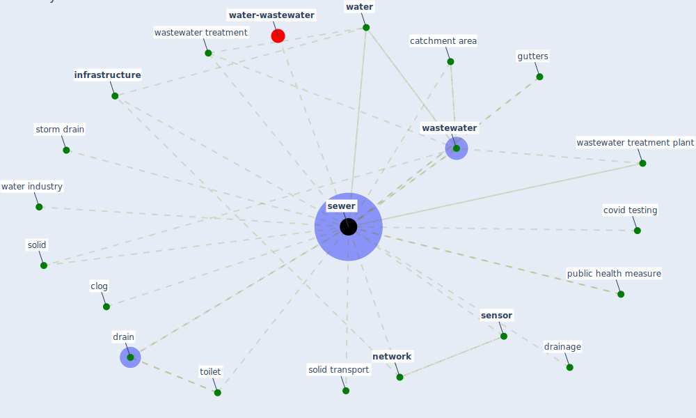

# Keyword: sewer

* [water-wastewater](cluster_7)

## Keywords

 * Cluster_7, catchment area, clog, covid testing, drain, drainage, gutters, [infrastructure](keyword_infrastructure), [network](keyword_network), public health measure, [sensor](keyword_sensor), [sewer](keyword_sewer), sewers, solid, solid transport, storm drain, [toilet](keyword_toilet), [wastewater](keyword_wastewater), wastewater treatment, wastewater treatment plant, [water](keyword_water), water industry

## Mapping

## Neighbours

### Closest articles

* When the fourth water and digital revolution encountered COVID-19 - [LINK](article_poch_when_2020)
* Future perspectives of wastewater-based epidemiology: Monitoring infectious disease spread and resistance to the community level - [LINK](article_sims_future_2020)
* Computational analysis of SARS-CoV-2/COVID-19 surveillance by wastewater-based epidemiology locally and globally: Feasibility, economy, opportunities and challenges - [LINK](article_hart_computational_2020)
* Green in times of COVID-19: urban green space relevance during the COVID-19 pandemic in Buenos Aires City - [LINK](article_marconi_green_2022)
* Detection of SARS-CoV-2 in raw and treated wastewater in Germany – Suitability for COVID-19 surveillance and potential transmission risks - [LINK](article_westhaus_detection_2021)
* Wastewater surveillance for population-wide Covid-19: The present and future - [LINK](article_daughton_wastewater_2020)
* Making green infrastructure healthier infrastructure - [LINK](article_lohmus_making_2015)
* Vector-borne disease, climate change and urban design - [LINK](article_ogden_vector-borne_2016)
* Designing for COVID-2x: Reflecting on Future-Proofing Human Habitation for the Inevitable Next Pandemic - [LINK](article_spennemann_designing_2022)

### Closest BPs

