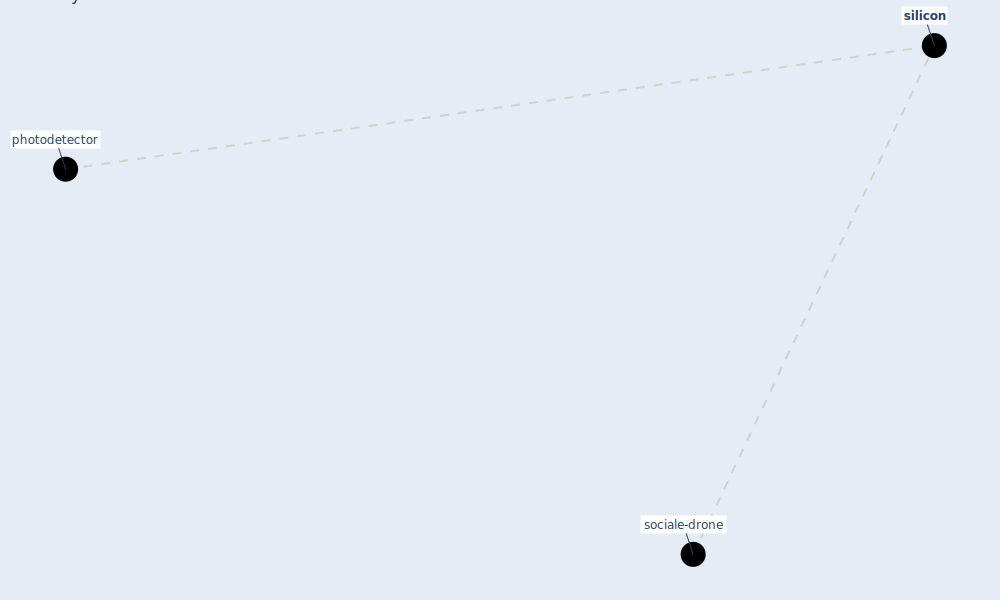

# Keyword: silicon

* [sociale-drone](cluster_6)

## Keywords

 * Cluster_6, photodetector, [silicon](keyword_silicon)

## Mapping

## Neighbours

### Closest articles

* Far-UVC light (222 nm) efficiently and safely inactivates airborne human coronaviruses - [LINK](article_buonanno_far-uvc_2020)

### Closest BPs

