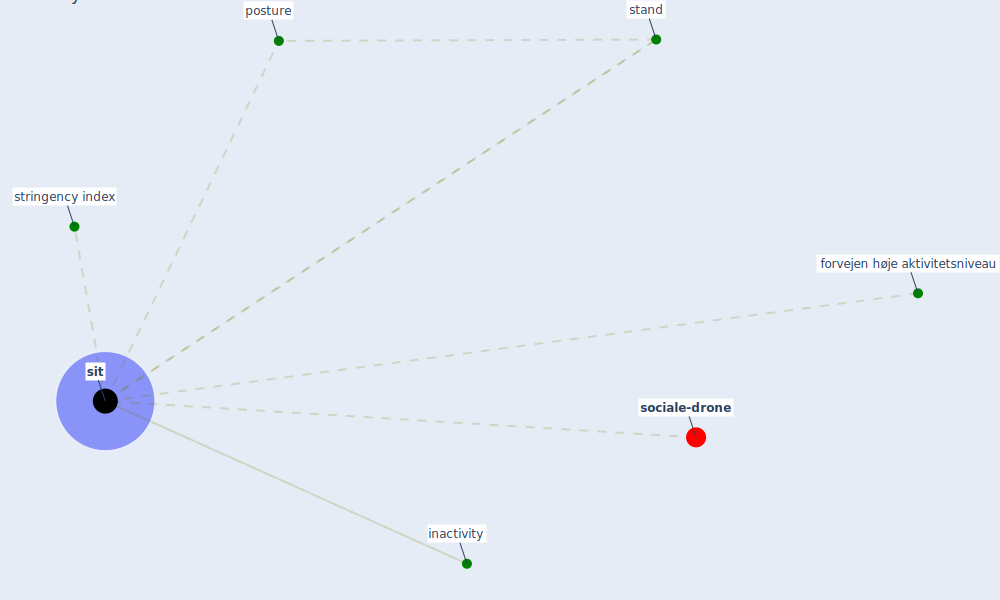

# Keyword: sit

* [sociale-drone](cluster_6)

## Keywords

 * Cluster_6, forvejen høje aktivitetsniveau, inactivity, posture, [sit](keyword_sit), sitting, stand, stringency index

## Mapping

## Neighbours

### Closest articles

* Health, Wellbeing \& Productivity in Offices - [LINK](article_world_green_building_council_health_2014)
* Refleksioner fra en pandemi - [LINK](article_realdania_refleksioner_2022)
* Mitigation strategies and compliance in the COVID-19 fight; how much compliance is enough? - [LINK](article_mukerjee_mitigation_2021)

### Closest BPs

