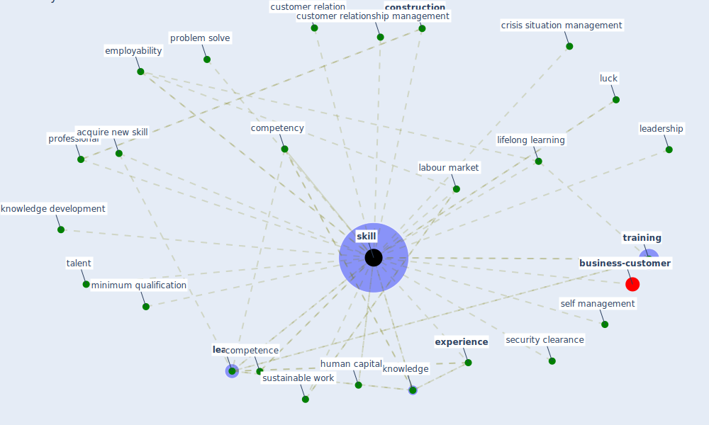

# Keyword: skill

* [business-customer](cluster_11)

## Keywords

 * Cluster_11, acquire new skill, competence, competency, [construction](keyword_construction), crisis situation management, customer relation, customer relationship management, employability, [experience](keyword_experience), human capital, [knowledge](keyword_knowledge), knowledge development, [labour market](keyword_labour_market), leadership, [learn](keyword_learn), lifelong learning, luck, minimum qualification, problem solve, [professional](keyword_professional), security clearance, self management, [skill](keyword_skill), skills, [sustainable work](keyword_sustainable_work), talent, [training](keyword_training)

## Mapping

## Neighbours

### Closest articles

* Sustainable work throughout the life course: National policies and strategies, Publications Office of the European Union - [LINK](article_eurofund_sustainable_2016)
* Case Study on Finnish TVETA Resilient Model of Training During COVID-19 - [LINK](article_unesco_case_2021)
* How COVID-19 Could Accelerate the Adoption of New Retail Technologies and Enhance the (E-)Servicescape - [LINK](article_willems_how_2021)
* Addressing vulnerability, building resilience: community-based adaptation to vector-borne diseases in the context of global change - [LINK](article_bardosh_addressing_2017)
* Propositions for a Resilient, Post-COVID-19 Future for the AEC Industry - [LINK](article_nassereddine_propositions_2021)
* What has been the impact of the COVID-19 pandemic on immigrants? An update on recent evidence - [LINK](article_oecd_what_2022)
* COVID-19: IMPACT OF THE PANDEMIC ON THE SUSTAINABLE DEVELOPMENT GOALS - [LINK](article_samout_covid-19_2020)
* Navigating Climate Change: Rethinking the Role of Buildings - [LINK](article_cole_navigating_2020)
* The changes in the effects of social media use of Cypriots due to COVID-19 pandemic - [LINK](article_kaya_changes_2020)
* Covid-19 and asset management in EU: a preliminary assessment of performance and investment styles - [LINK](article_rizvi_covid-19_2020)

### Closest BPs

