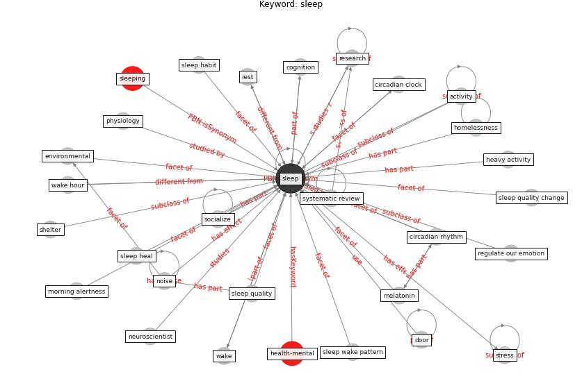

# Keyword: sleep

* [mental-health](cluster_Cluster_11)

## Keywords

 * Cluster_11, [activity](keyword_activity), [bedroom](keyword_bedroom), circadian clock, circadian rhythm, cognition, diurnal cycle, door, environmental, environmental design parameter, [exposure](keyword_exposure), function, [health](keyword_health), heart, heavy activity, hibernate, [homelessness](keyword_homelessness), insomnia, leisure, leisure pursuit, live, melatonin, melatonin suppression, morning alertness, neuroscientist, [noise](keyword_noise), physiology, regulate our emotion, [research](keyword_research), rest, shelter, [sleep](keyword_sleep), sleep habit, sleep heal, sleep quality, sleep quality change, sleep wake pattern, sleeping, socialize, [stress](keyword_stress), systematic review, [thermal comfort](keyword_thermal_comfort), wake, wake hour

## Concepts

 

## Neighbours

### Closest articles

* How our homes impact our health: using a COVID-19 informed approach to examine urban apartment housing - [LINK](article_peters_how_2020)
* Home garden use during COVID-19: Associations with physical and mental wellbeing in older adults - [LINK](article_corley_home_2021)
* Health, Wellbeing \& Productivity in Offices - [LINK](article_world_green_building_council_health_2014)
* Eviction, Health Inequity, and the Spread of COVID-19: Housing Policy as a Primary Pandemic Mitigation Strategy - [LINK](article_benfer_eviction_2021)
* COVID19-Routes: A Safe Pedestrian Navigation Service - [LINK](article_cantarero_covid19-routes_2021)
* Readiness Assessment of Green Building Certification Systems for Residential Buildings during Pandemics - [LINK](article_tleuken_readiness_2021)
* Occupants’ behavior and activity patterns influencing the energy consumption in the Kuwaiti residences - [LINK](article_al-mumin_occupants_2003)
* Occupant health in buildings: Impact of the COVID-19 pandemic on the opinions of building professionals and implications on research - [LINK](article_awada_occupant_2022)
* Ten questions concerning occupant health in buildings during normal operations and extreme events including the COVID-19 pandemic - [LINK](article_awada_ten_2021)
* Designing for COVID-2x: Reflecting on Future-Proofing Human Habitation for the Inevitable Next Pandemic - [LINK](article_spennemann_designing_2022)

### Closest BPs

