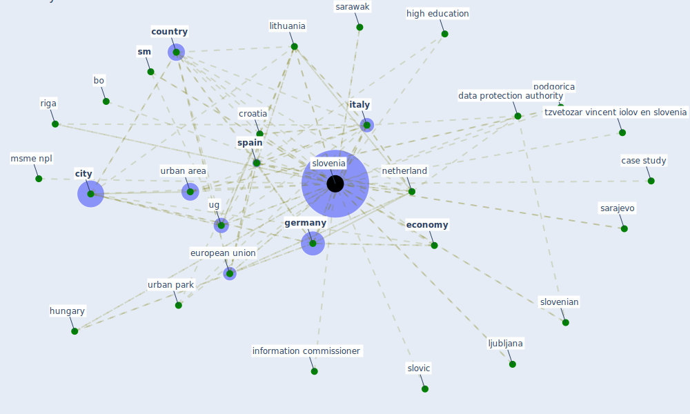

# Keyword: slovenia

## Keywords

 * bank of slovenia, bo, case study, case study of slovenia, [city](keyword_city), [country](keyword_country), covid 19 psynetpandemic, [covid-19](keyword_covid-19), [croatia](keyword_croatia), data protection authority, [economy](keyword_economy), [european union](keyword_european_union), [germany](keyword_germany), high education, hungary, information commissioner, information commissioner of slovenia, [italy](keyword_italy), lava, lithuania, ljubljana, msme npl, msme npl portfolio, [netherland](keyword_netherland), [podgorica](keyword_podgorica), riga, sarajevo, sarawak, [slovenia](keyword_slovenia), slovenian, slovic, [sm](keyword_sm), [spain](keyword_spain), tzvetozar vincent iolov en slovenia, [ug](keyword_ug), urban area, urban park, wiod

## Mapping

## Neighbours

### Closest articles

* Effects of the COVID-19 pandemic on the use and perceptions of urban green space: An international exploratory study - [LINK](article_ugolini_effects_2020)
* How COVID-19 Could Accelerate the Adoption of New Retail Technologies and Enhance the (E-)Servicescape - [LINK](article_willems_how_2021)
* World Bank Development Report - [LINK](article_world_bank_world_2022)
* 2020 Data Protection Report - [LINK](article_council_of_europe_2020_2020)
* Towards Resilient Residential Buildings and Neighborhoods in Light of COVID-19 Pandemic—The Scenario of Podgorica, Montenegro - [LINK](article_bojovic_towards_2022)
* Biophilic design in architecture and its contributions to health, well-being, and sustainability: A critical review - [LINK](article_zhong_biophilic_2022)
* The Impact of COVID-19 on Public Space: A Review of the Emerging Questions - [LINK](article_honey-roses_impact_2020)
* Impact of Covid-19 on the built environment - [LINK](article_mahima_impact_2022)
* Questioning the use of the balcony in apartments during the COVID-19 pandemic process - [LINK](article_aydin_questioning_2020)
* DeepSOCIAL: Social Distancing Monitoring and Infection Risk Assessment in COVID-19 Pandemic - [LINK](article_rezaei_deepsocial_2020)

### Closest BPs

