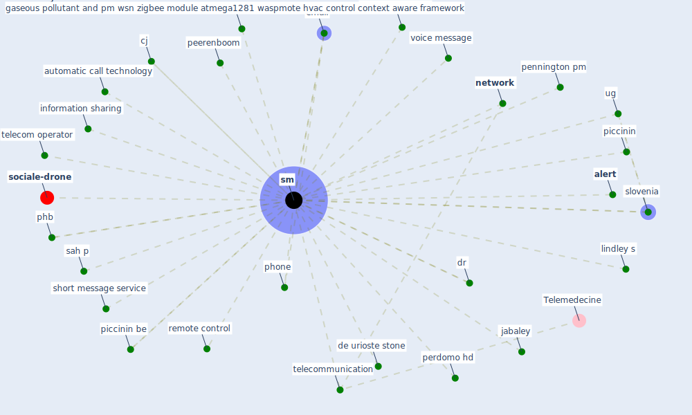

# Keyword: sm

* [sociale-drone](cluster_6)

## Keywords

 * Cluster_6, [alert](keyword_alert), automatic alert, automatic alert system, automatic call, automatic call technology, ayyoubzadeh sm, [bluetooth](keyword_bluetooth), chander, cj, [covid-19](keyword_covid-19), de urioste stone, dr, email, gaseous pollutant and pm wsn zigbee module atmega1281 waspmote hvac control context aware framework, information sharing, jabaley, lindley s, message, [network](keyword_network), peerenboom, pennington pm, perdomo hd, phb, phone, piccinin, piccinin be, remote control, sah p, short message service, [slovenia](keyword_slovenia), [sm](keyword_sm), sms, telecom operator, telecommunication, [ug](keyword_ug), voice message

## Mapping

## Neighbours

### Closest articles

* Effects of the COVID-19 pandemic on the use and perceptions of urban green space: An international exploratory study - [LINK](article_ugolini_effects_2020)
* A comprehensive review on indoor air quality monitoring systems for enhanced public health - [LINK](article_saini_comprehensive_2020)
* 2020 Data Protection Report - [LINK](article_council_of_europe_2020_2020)
* Response to COVID-19 in Taiwan - [LINK](article_wang_response_2020)
* Challenges of data sharing in European Covid-19 projects: A learning opportunity for advancing pandemic preparedness and response - [LINK](article_tacconelli_challenges_2022)
* COVID19-Routes: A Safe Pedestrian Navigation Service - [LINK](article_cantarero_covid19-routes_2021)
* Pandemic Analytics: How Countries are Leveraging Big Data Analytics and Artificial Intelligence to Fight COVID-19? - [LINK](article_mehta_pandemic_2021)
* A Platform for Citizen Cooperation during the COVID-19 Pandemic in RN, Brazil - [LINK](article_de_araujo_platform_2020)
* Assessment of COVID-19 precautionary measures in sports facilities: A case study on a health club in Saudi Arabia - [LINK](article_ibrahim_assessment_2022)
* Addressing vulnerability, building resilience: community-based adaptation to vector-borne diseases in the context of global change - [LINK](article_bardosh_addressing_2017)

### Closest BPs

