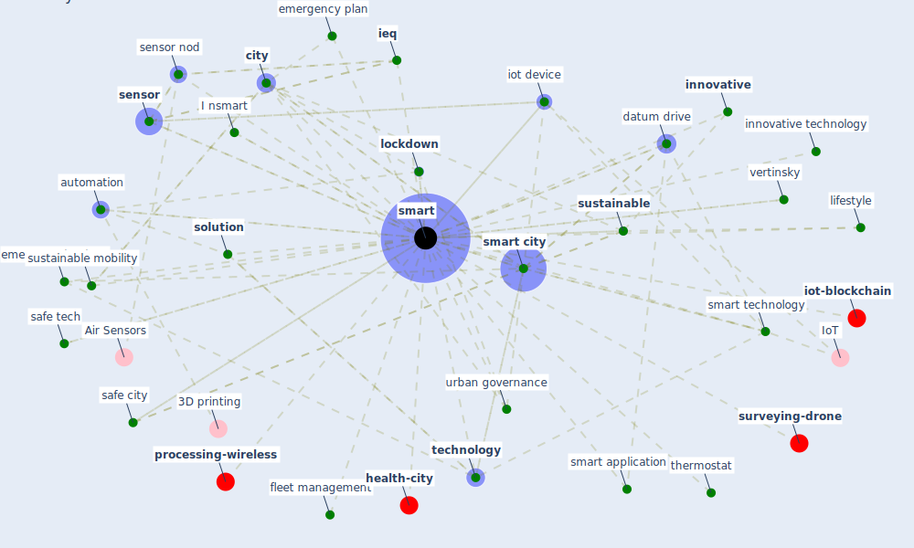

# Keyword: smart

* [urban-city](cluster_4)

* [datum-iot](cluster_6)

## Keywords

 * Cluster_4, Cluster_6, I nsmart, automation, automation of urban dimension, [city](keyword_city), [covid-19](keyword_covid-19), datum drive, emerge technology, emergency plan, efficiently prevent virus propagation, fleet management, grid connected building, iec, [ieq](keyword_ieq), industrialise prefabrication, innovative, innovative technology, inventory management system, iot device, knowledge base, lifestyle, [lockdown](keyword_lockdown), nanotech, quarantine, [safe city](keyword_safe_city), safe tech, [sensor](keyword_sensor), sensor nod, [smart](keyword_smart), smart application, [smart city](keyword_smart_city), smart technology, smarter, [solution](keyword_solution), sustainable, sustainable mobility, [technology](keyword_technology), [thermostat](keyword_thermostat), [urban governance](keyword_urban_governance), vertinsky, wearable

## Mapping

## Neighbours

### Closest articles

* Impact of COVID-19 on IoT Adoption in Healthcare, Smart Homes, Smart Buildings, Smart Cities, Transportation and Industrial IoT - [LINK](article_umair_impact_2021)
* The Emergence of Anti-Privacy and Control at the Nexus between the Concepts of Safe City and Smart City - [LINK](article_allam_emergence_2019)
* Scalable IoT Architecture for Monitoring IEQ Conditions in Public and Private Buildings - [LINK](article_calvo_scalable_2022)
* Contributions of Smart City Solutions and Technologies to Resilience against the COVID-19 Pandemic: A Literature Review - [LINK](article_sharifi_contributions_2021)
* Assessment method for new sustainability indicators providing pandemic resilience for residential buildings - [LINK](article_tokazhanov_assessment_2021)
* Future (post-COVID) digital, smart and sustainable cities in the wake of 6G: Digital twins, immersive realities and new urban economies - [LINK](article_allam_future_2021)
* Prophylactic Architecture: Formulating the Concept of Pandemic-Resilient Homes - [LINK](article_elrayies_prophylactic_2022)
* COVID-ABS: An agent-based model of COVID-19 epidemic to simulate health and economic effects of social distancing interventions - [LINK](article_silva_covid-abs_2020)
* How COVID-19 Could Accelerate the Adoption of New Retail Technologies and Enhance the (E-)Servicescape - [LINK](article_willems_how_2021)
* Ten questions concerning occupant health in buildings during normal operations and extreme events including the COVID-19 pandemic - [LINK](article_awada_ten_2021)

### Closest BPs

