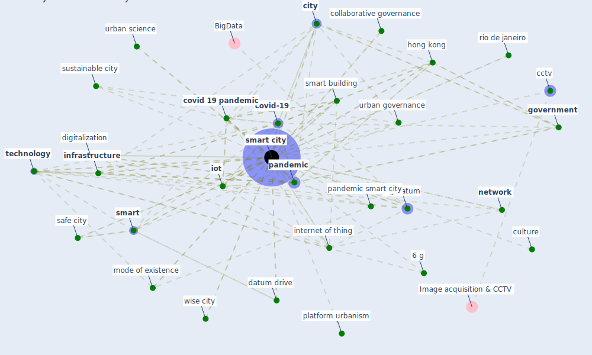

# Keyword: smart city

## Keywords

 * [5 g](keyword_5_g), 5 g technol ogy, [6 g](keyword_6_g), amsterdam, angelidou, articulate mode of existence, big city, [big datum](keyword_big_datum), big datum analytic, [brazil](keyword_brazil), calzada, cctv, cisco, [city](keyword_city), collaborative governance, [covid 19 crisis](keyword_covid_19_crisis), [covid 19 pandemic](keyword_covid_19_pandemic), [covid-19](keyword_covid-19), culture, datum drive, digitalization, digitisation, [ecosystem](keyword_ecosystem), flu city, [government](keyword_government), [hong kong](keyword_hong_kong), information technology, [infrastructure](keyword_infrastructure), intelligent transportationsystem, [internet of thing](keyword_internet_of_thing), internet of thing iot, [iot](keyword_iot), iot sensor, [japan](keyword_japan), lacinák m, mancebo, metabolism, micro operation, [mode of existence](keyword_mode_of_existence), [network](keyword_network), [pandemic](keyword_pandemic), pandemic avatar, pandemic control, pandemic smart city, people who live in they, pilot venture, platform urbanism, post-pandemic, pragmatist, present pandemic, privacy concern in smart city, [public administration](keyword_public_administration), public private partnership, resilience in smart city, resilience of city, [resilient](keyword_resilient), rio de janeiro, [safe city](keyword_safe_city), scienze regionali, sharifi, [smart](keyword_smart), [smart building](keyword_smart_building), [smart city](keyword_smart_city), smart city 2 2, smart city development, smart city platform, smart city project, smart space, smart technology, smart transportation, smart urban technology, smart utopia, smartness, strategic plan, [surveillance](keyword_surveillance), surveillance datum, surveillance technology, [sustainability](keyword_sustainability), sustainable, sustainable city, taipei, [technology](keyword_technology), technology and innovation, the smart city and covid 19, towards sustainable smart city, transition, urban area, urban geography, [urban governance](keyword_urban_governance), urban governance model, urban health, urban management, [urban planning](keyword_urban_planning), urban science, utopia, video surveillance, wireless connection, wise city, xr, yigitcanlar

## Mapping

## Neighbours

### Closest articles

* Future (post-COVID) digital, smart and sustainable cities in the wake of 6G: Digital twins, immersive realities and new urban economies - [LINK](article_allam_future_2021)
* Learning from the COVID-19 pandemic in governing smart cities - [LINK](article_bolivar_learning_2022)
* The Emergence of Anti-Privacy and Control at the Nexus between the Concepts of Safe City and Smart City - [LINK](article_allam_emergence_2019)
* Impact of COVID-19 on IoT Adoption in Healthcare, Smart Homes, Smart Buildings, Smart Cities, Transportation and Industrial IoT - [LINK](article_umair_impact_2021)
* The three modes of existence of the pandemic smart city - [LINK](article_soderstrom_three_2021)
* Contributions of Smart City Solutions and Technologies to Resilience against the COVID-19 Pandemic: A Literature Review - [LINK](article_sharifi_contributions_2021)
* Smart cities and the pandemic: digital technologies on the urban management of Brazilian cities - [LINK](article_fariniuk_smart_2020)
* The Smart City and Covid‐19 - [LINK](article_webb_smart_2020)
* An Automated System to Limit COVID-19 Using Facial Mask Detection in Smart City Network - [LINK](article_rahman_automated_2020)
* Smart cities and a data-driven response to COVID-19 - [LINK](article_james_smart_2020)

### Closest BPs

