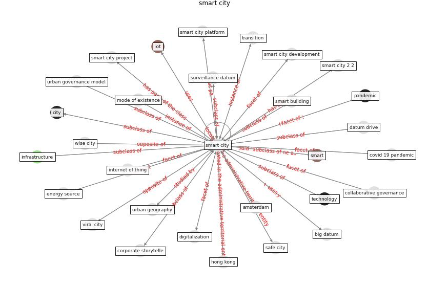

# Keyword: __smart city__

## Concepts

 

## Top articles for __smart city__
* Future (post-COVID) digital, smart and sustainable
cities in the wake of 6G: Digital twins, immersive
realities and new urban economies ([allam_future_2021](article_allam_future_2021))
* Learning from the COVID-19 pandemic in governing smart
cities ([bolivar_learning_2022](article_bolivar_learning_2022))
* Smart cities and a data-driven response to COVID-19 ([james_smart_2020](article_james_smart_2020))
* Contributions of Smart City Solutions and
Technologies to Resilience against the COVID-19
Pandemic: A Literature Review ([sharifi_contributions_2021](article_sharifi_contributions_2021))
* The three modes of existence of the pandemic smart city ([soderstrom_three_2021](article_soderstrom_three_2021))
* Impact of COVID-19 on IoT Adoption in Healthcare,
Smart Homes, Smart Buildings, Smart Cities,
Transportation and Industrial IoT ([umair_impact_2021](article_umair_impact_2021))
* The Smart City and Covid‐19 ([webb_smart_2020](article_webb_smart_2020))
