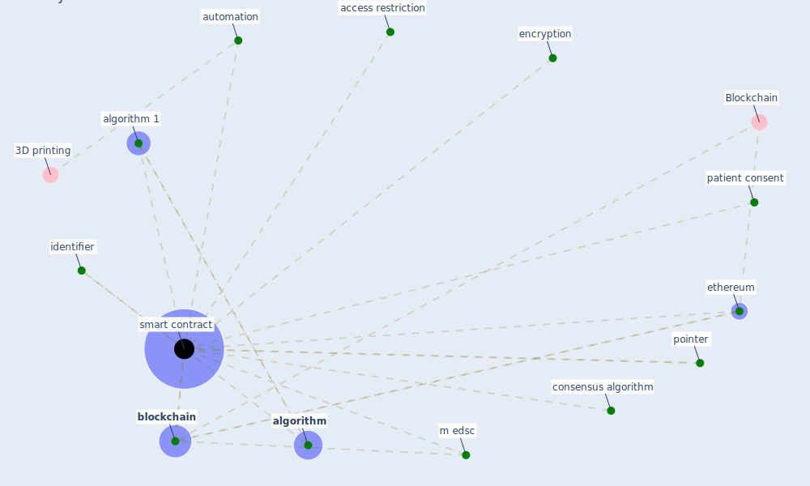

# Keyword: smart contract

## Keywords

 * access restriction, [algorithm](keyword_algorithm), algorithm 1, automation, [blockchain](keyword_blockchain), consensus algorithm, encryption, [ethereum](keyword_ethereum), identifier, m edsc, patient consent, pointer, [smart contract](keyword_smart_contract), smart contracts

## Mapping

## Neighbours

### Closest articles

* Health Information Exchange with Blockchain amid Covid-19-like Pandemics - [LINK](article_christodoulou_health_2020)
* A Comprehensive Review of the COVID-19 Pandemic and the Role of IoT, Drones, AI, Blockchain, and 5G in Managing its Impact - [LINK](article_chamola_comprehensive_2020)
* Blockchain technology and its applications to combat COVID-19 pandemic - [LINK](article_sharma_blockchain_2022)
* Future (post-COVID) digital, smart and sustainable cities in the wake of 6G: Digital twins, immersive realities and new urban economies - [LINK](article_allam_future_2021)
* The Emergence of Anti-Privacy and Control at the Nexus between the Concepts of Safe City and Smart City - [LINK](article_allam_emergence_2019)

### Closest BPs

