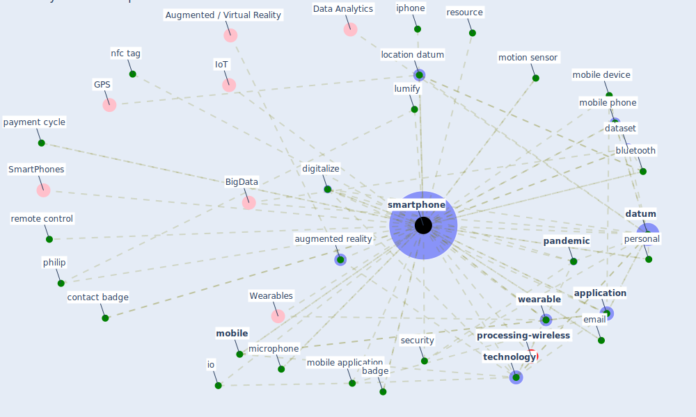

# Keyword: smartphone

* [processing-wireless](cluster_14)

## Keywords

 * Cluster_14, SmartPhones, Wearables, accessory, alternative method, android, apple, [application](keyword_application), application software, arpaci, augmented reality, badge, battery, [big datum](keyword_big_datum), [bluetooth](keyword_bluetooth), bluetooth low energy, cell use, charge, charge cord, [computer](keyword_computer), computer relate product, [consumer](keyword_consumer), contact badge, [contactless](keyword_contactless), [dataset](keyword_dataset), [datum](keyword_datum), detect virus, digitalize, email, how many smartphone be in the world, huawei, [ibem](keyword_ibem), idle time, infrastruktur, instagram, [internet](keyword_internet), io, iphone, [lift](keyword_lift), location datum, lumify, microphone, [mobile](keyword_mobile), mobile application, mobile device, mobile money, mobile phone, mobile suite of accessory, [mobility](keyword_mobility), motion sensor, nfc tag, nokia, off the shelf, off the shelf device, operate system, [pandemic](keyword_pandemic), payment cycle, pda s, personal, philip, purchase, purchase decision make, remote control, resource, screen, [security](keyword_security), [sensor](keyword_sensor), sikker infrastruktur, smart development, smart gadget, smart speaker, smart wearable, [smartphone](keyword_smartphone), smartphones, smartwatche, [surveillance](keyword_surveillance), t mobile, [technology](keyword_technology), [united kingdom](keyword_united_kingdom), usage, [wearable](keyword_wearable), whoop journal

## Mapping

## Neighbours

### Closest articles

* Digital Twin of COVID-19 Mass Vaccination Centers - [LINK](article_pilati_digital_2021)
* Mobile Technology Solution for COVID-19: Surveillance and Prevention - [LINK](article_raza_mobile_2021)
* Impact of COVID-19 on IoT Adoption in Healthcare, Smart Homes, Smart Buildings, Smart Cities, Transportation and Industrial IoT - [LINK](article_umair_impact_2021)
* How COVID-19 Could Accelerate the Adoption of New Retail Technologies and Enhance the (E-)Servicescape - [LINK](article_willems_how_2021)
* 2020 Data Protection Report - [LINK](article_council_of_europe_2020_2020)
* Leveraging Digital Transformation Technologies to Tackle COVID-19: Proposing a Privacy-First Holistic Framework - [LINK](article_arpaci_leveraging_2021)
* A Comprehensive Review of the COVID-19 Pandemic and the Role of IoT, Drones, AI, Blockchain, and 5G in Managing its Impact - [LINK](article_chamola_comprehensive_2020)
* World Bank Development Report - [LINK](article_world_bank_world_2022)
* Touchless Retail: What the Rest of the World could learn from China’s new ways to shop - [LINK](article_capgemini_touchless_2020)
* Wastewater-Based Epidemiology to monitor COVID-19 outbreak: Present and future diagnostic methods to be in your radar - [LINK](article_barcelo_wastewater-based_2020)

### Closest BPs

