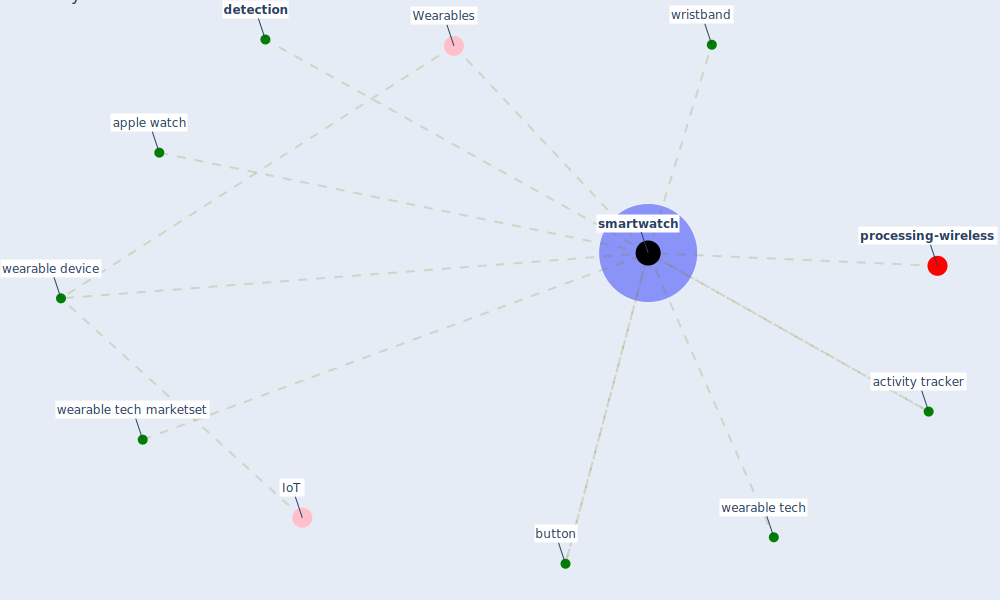

# Keyword: smartwatch

* [processing-wireless](cluster_14)

## Keywords

 * Cluster_14, Wearables, activity tracker, apple watch, button, [detection](keyword_detection), [smartwatch](keyword_smartwatch), wearable device, wearable tech, wearable tech marketset, wristband

## Mapping

## Neighbours

### Closest articles

* Impact of COVID-19 on IoT Adoption in Healthcare, Smart Homes, Smart Buildings, Smart Cities, Transportation and Industrial IoT - [LINK](article_umair_impact_2021)
* A Comprehensive Review of the COVID-19 Pandemic and the Role of IoT, Drones, AI, Blockchain, and 5G in Managing its Impact - [LINK](article_chamola_comprehensive_2020)
* Contributions of Smart City Solutions and Technologies to Resilience against the COVID-19 Pandemic: A Literature Review - [LINK](article_sharifi_contributions_2021)

### Closest BPs

