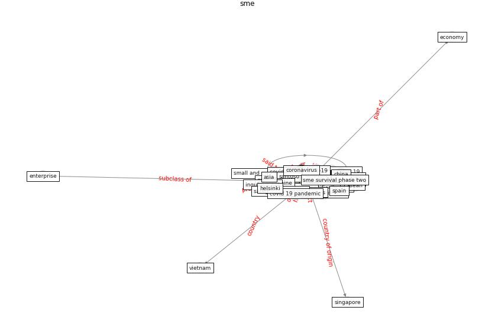

# Keyword: sme

* [customer-brand](cluster_Cluster_8)

## Keywords

 * 154 ö, 7 building agility in service, Cluster_8, agile, albaz, [asean](keyword_asean), asia, branching strategy, build agility in service, [business](keyword_business), cgc, [china](keyword_china), [coronavirus](keyword_coronavirus), coronavirus covid 19, [covid 19 crisis](keyword_covid_19_crisis), [covid 19 pandemic](keyword_covid_19_pandemic), covid 19 precaution, [covid-19](keyword_covid-19), credit crunch, [customer](keyword_customer), customer relationship, datum center, demand, develop asian country, disruption from covid 19, [economy](keyword_economy), enterprise, [entrepreneur](keyword_entrepreneur), [entrepreneurship](keyword_entrepreneurship), european, european sme, [european union](keyword_european_union), [evidence](keyword_evidence), financing, [firm](keyword_firm), gdp, global crisis, [government](keyword_government), helsinki, image recognition, image recognition software, [industry](keyword_industry), informal economy, inquirere net, kim willems, kurniawati, large company, large enterprise, leader of service, loan, loan demand function, malaika brengman 7, [malaysia](keyword_malaysia), mansour, [manufacture](keyword_manufacture), mark s, new normal, [organization](keyword_organization), outbreak of covid 19, [pandemic](keyword_pandemic), philippine, physical data center, [policy](keyword_policy), primary victim of the pandemic, process industry, public credit guarantee scheme, putra, resilient, resilient sme, rida, safeguard economy, santoso, schubert, [service](keyword_service), service sme, [singapore](keyword_singapore), small and medium enterprise, small business, small medium enterprise, [sme](keyword_sme), sme survival phase two, smes, smovid 19 outbreak, [south korea](keyword_south_korea), [spain](keyword_spain), spanish, specifically, spigel, start up, start up initiative, [startup](keyword_startup), strategic sensitivity, turkey, vienna initiative, vietnam, yuliando

## Concepts

 

## Neighbours

### Closest articles

* COVID-19 and regional solutions for mitigating the risk of SME finance in selected ASEAN member states - [LINK](article_taghizadeh-hesary_covid-19_2022)
* How COVID-19 Could Accelerate the Adoption of New Retail Technologies and Enhance the (E-)Servicescape - [LINK](article_willems_how_2021)
* <scp>COVID</scp>             ‐19: Small and medium enterprises challenges and responses with creativity, innovation, and entrepreneurship - [LINK](article_thukral_covid19_2021)
* Startups in times of crisis – A rapid response to the COVID-19 pandemic - [LINK](article_kuckertz_startups_2020)
* World Bank Development Report - [LINK](article_world_bank_world_2022)
* Organizations’ Management of the COVID-19 Pandemic: A Scoping Review of Business Articles - [LINK](article_boiral_organizations_2021)
* Future (post-COVID) digital, smart and sustainable cities in the wake of 6G: Digital twins, immersive realities and new urban economies - [LINK](article_allam_future_2021)
* Mechanisms for addressing the impact of COVID-19 on infrastructure projects - [LINK](article_king_mechanisms_2021)
* Case Study on Finnish TVETA Resilient Model of Training During COVID-19 - [LINK](article_unesco_case_2021)
* A review of definitions and measures of system resilience - [LINK](article_hosseini_review_2016)

### Closest BPs

